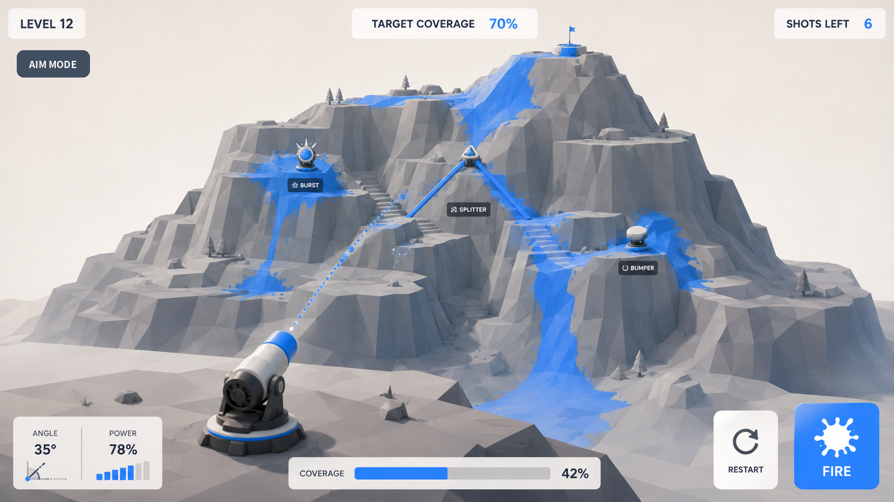
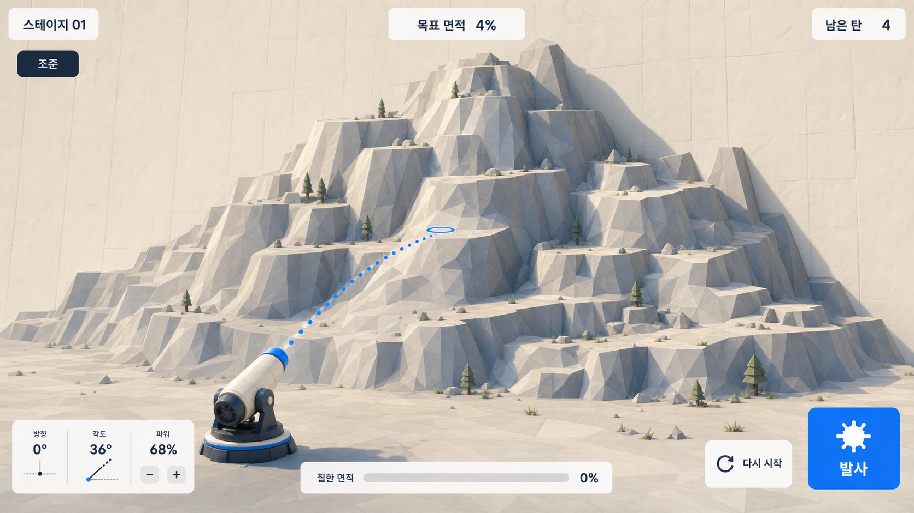
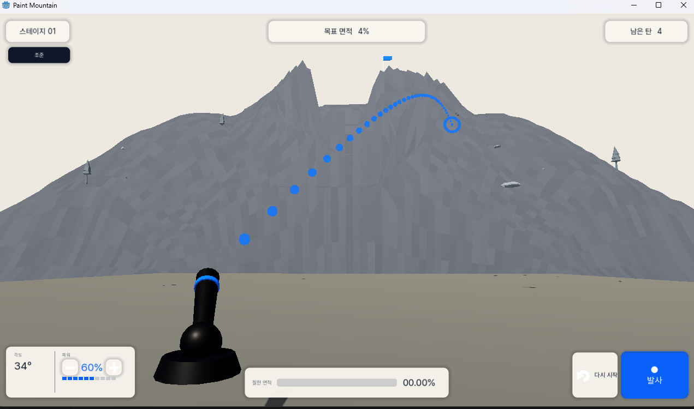
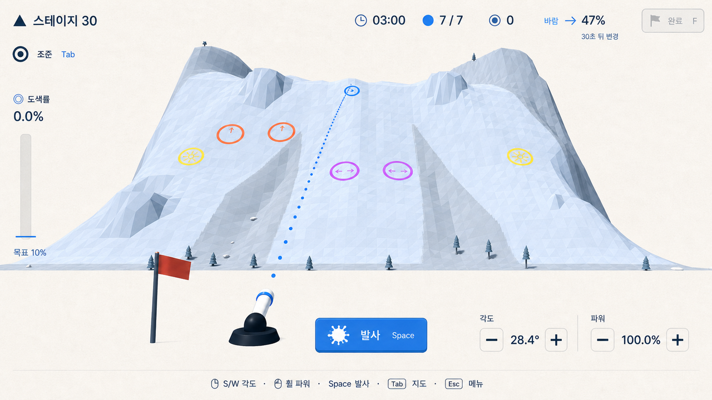

# Paint Mountain Visual References

## Purpose

Register the visual evidence used by Paint Mountain and state what each source
can and cannot decide. This document prevents historical captures, generated
concepts, or asset previews from silently becoming product requirements.

## Sources

### Primary target comparator

- Image: [primary target comparator](../../docs/handoffs/gameplay-visual-reset-2026-08-03/visuals/01-target-reference.png)
- Provenance: original user-supplied design reference.
- SHA-256:
  `1E32C82DF16DBE0809458DC7A7D9385C7EB3A61D0240BD8551B40F02190E4538`
- Use for: dominant thick low-poly mountain, layered terraces and routes, small
  cannon, sparse HUD, paint contrast, mechanism readability, bright restraint,
  and overall visual ambition.
- Do not copy: literal mountain topology, mechanism locations, English copy,
  horizontal coverage bar, bottom-right Restart, exact painted state, or implied
  physics. Later accepted UI decisions supersede those image details.

### Secondary concept board

- Gallery: [generated outcome concept board](../evidence/concepts/execplan-outcome-2026-08-03/index.html)
- Images: `../evidence/concepts/execplan-outcome-2026-08-03/01_stage_progression.png`
  through `07_stage3_clear.png`.
- Use for: warm off-white palette, faceting, apparent thickness, wall join,
  composition options, camera depth, Korean UI tone, and state readability.
- Do not use as: a runtime screenshot, feasibility proof, literal geometry,
  exact HUD contract, stage seed, mechanism placement, or acceptance evidence.

### Historical aiming-HUD direction

- Image: [Command Columns HUD](../research/concepts/ui-layout-directions-2026-08-06/command-columns-hud.png)
- Provenance: generated from the current Stage 30 running render and selected by
  the user on 2026-08-06 for implementation.
- SHA-256:
  `1B4AF8DDFF91D5A23238296EC3C886F17CA18E2FC00F2FA93811B50EEEEDCA0F`.
- Historical use: the aiming HUD's narrow command/status columns,
  bottom-center Fire action, warm restrained panel treatment, and compact Korean
  typography rhythm.
- Historical runtime/spec details omitted or simplified in the image included
  focusable Gear, direction value, power-step controls, Aim Lock/Map Inspection,
  dynamic weather detail, disabled/readiness states, and authoritative live
  values. These are not current requirements.
- Do not use as: world-render authority, literal stage/mechanism placement,
  runtime proof, a reason to fake state, or permission to remove functionality.
- Status: superseded on 2026-08-08 by the user's casual shared UI direction.
  Preserve only the still-valid real actions and edge-first hierarchy recorded
  in `UIUX_GUIDELINES.md`; do not preserve the literal columns, panel details,
  or the weather instrumentation retired on 2026-08-09.
- The sibling `quiet-edge-hud.png` and `instrument-rail-hud.png` remain historical
  alternatives, not active directions.

### Historical anti-reference

- Image: [rejected historical build](../../docs/handoffs/gameplay-visual-reset-2026-08-03/visuals/02-current-build.png)
- Provenance: user-supplied capture of the rejected build.
- SHA-256:
  `AEDE8587A122B1977AE4C87FA551E8CE6383AC94B0A9D3EE39024E29F184E173`
- Use for: detecting recurrence of the gray wall/mound, card-like depth,
  dominant flat foreground, oversized black cannon, weak route/mechanism
  visibility, oversized trajectory dots, and legacy HUD hierarchy.
- Do not use as: proof of the current revision or a layout to preserve.

### Current exploratory casual UI matrix

- Gallery: [Casual UI Directions](../research/concepts/casual-ui-directions-2026-08-08/index.html)
- Images: `../research/concepts/casual-ui-directions-2026-08-08/01-paper-toy-main-menu.png`
  through `09-field-guide-aim-view.png`.
- Provenance: nine independent ImageGen outputs grounded in the matching
  running-game capture and the primary target comparator.
- Use for: comparing three component languages across Main Menu, Stage Select,
  and Aim View: Paper Toy Adventure, Sticker Arcade, and Quiet Field Guide.
- Historical recommendation: borrow Paper Toy's tactile surfaces for menus and
  Field Guide's restraint for the gameplay HUD. The later approved Quiet
  Context system below supersedes this recommendation.
- Do not use as: runtime proof, approved implementation authority, a source of
  gameplay values, or permission to add invented actions. The implemented Theme
  and `UIUX_GUIDELINES.md` remained authoritative until the user selected the
  later concept.

### Approved Quiet Context UI system

- Image: [approved Quiet Context UI](../evidence/concepts/full-ui-refresh-2026-08-09/revised-02-context-line.png)
- Provenance: ImageGen revision grounded in the current running Stage 30 Aim
  View, selected explicitly by the user on 2026-08-09.
- SHA-256:
  `715DA06D3825E97B0C89975153289ECC0BF11F41A9C93A5129DC8397E2DDC33A`.
- Current use: direct edge-aligned status, warm paper-white field, navy type,
  blue primary action, left coverage rail, centered Fire, right-side
  angle/power instruments, minimal containment, and one
  quiet lower-edge context legend with inline input/action pairs.
- Apply across: Main Menu, Stage Select, Briefing, Aim View, Map View, Shot
  Follow, Pause, Settings, transient feedback, and Result using the same Theme,
  spacing, divider, action, focus, and disabled-state principles.
- Preserve beyond the still: real Gear, Finish, loading/failure, Map/Follow,
  focus, localization, settings, and result behavior even when the generated
  image omits or simplifies them.
- Do not copy: generated mountain/glyph placement, fake state, missing actions,
  text artifacts, or exact pixels that conflict with responsive layout. Do not
  retain detached dark keycap tiles or visible target-derived yaw.
- Status: approved visual authority for the UI system. Running-build captures
  remain required implementation and acceptance evidence.

### Approved Essential UI fidelity set

- Report: [2026-08-10 screen audit and refined targets](../../docs/reports/screen-audit-2026-08-10/index.html)
- Provenance: seven ImageGen edits grounded in the matching running-game
  captures and the already approved Quiet Context redesigns. The user explicitly
  approved the retained style and requested this copy-and-boundary refinement on
  2026-08-10.
- Images and SHA-256:
  - `../../docs/reports/screen-audit-2026-08-10/assets/refined/01-main-menu-refined.png`
    — `3180F3CBE62ADBE6A7C4EF9DDB20B790199037551CC69CA3A4D47CACF761A0AB`
  - `../../docs/reports/screen-audit-2026-08-10/assets/refined/02-stage-select-refined.png`
    — `534AE4D710034E7812CBC9463A8F1E33CD02A790010B6C683D17680497CC788B`
  - `../../docs/reports/screen-audit-2026-08-10/assets/refined/03-briefing-refined.png`
    — `6A391F80DAF526A4785CF7189FDE779C6B2DD1DADB2A4F03DBDD5A3245B5D6D5`
  - `../../docs/reports/screen-audit-2026-08-10/assets/refined/04-aim-view-refined.png`
    — `38F75235B126CC5995BA53E61665AEE9DCD397B27CA92939B08BE90ED10E76B1`
  - `../../docs/reports/screen-audit-2026-08-10/assets/refined/08-settings-refined.png`
    — `F6C5A4C34D0B32A14C2D8908ACCDE35D2630C623DF6F2B9B458AA3EBB99B845E`
  - `../../docs/reports/screen-audit-2026-08-10/assets/refined/09-manual-result-refined.png`
    — `BAB75443FE83FE5D5034ACE8A03FB844E2ED8252BBE4BD7693754D04BE449604`
  - `../../docs/reports/screen-audit-2026-08-10/assets/refined/10-timeout-result-refined.png`
    — `178BB88187B11BF6CCD87D17348AA8DEE61908E74228A53A5735B198D474F28B`
- Use literally for: which normal-screen copy is visible, the absence of
  duplicated key names inside actions, the absence of decorative hairlines and
  repeated unselected-card outlines, primary/secondary/tertiary action hierarchy,
  and the intended relative UI/world occupancy at a 16:9 baseline.
- Use directionally for: exact responsive coordinates, mountain shape, terrain
  seed, paint marks, lighting details, glyph placement, camera interpolation,
  and text rasterization. Runtime layout must use real translated strings and
  authoritative game state.
- Screen scope: Main Menu, Stage Select, Briefing, Aim View, Settings, Manual
  Result, and Timeout Result. The approved Quiet Context image and the existing
  three screen-audit improvements remain the direction for Map View, Shot Follow,
  and Pause until a later user revision replaces them.
- Status: approved fidelity targets for the named screens. They supersede the
  earlier screen-audit improvement images only for those seven screens, and
  supersede the Quiet Context reference only where visible copy, separator use,
  or screen composition conflicts. Running-build captures remain required
  implementation and acceptance evidence.

### Superseded Aiming Selection correction

- Report: [2026-08-20 Aiming Selection refinement](../../docs/reports/ui-refinement-2026-08-20/index.html)
- Assets: the report's `assets/shared-component-system.svg`, three selectable
  Aim composition targets, and the Stage Select, Briefing, and Result targets.
  Each screen remains grounded in its latest running-game `assets/current-*.png`
  source.
- SHA-256: component system
  `DFDE123DEAF19BF0F2B878FE6876DF443C5D7632C0A14A1B27FA964892B8C96F`;
  Aim A `2DE88D2409C34A82DB1B6DF1CD5FDD478A9C2C5E1B477DED0522710C5800EB9F`;
  Aim B `685F2579D4804E72A84FFAE02E1C7171C775E77BC2F537488350F3FC1FEB614B`;
  Aim C `61C20211BD41C5BEFCF6C016AF5590808AB505D6D97E07536CE69C31384D7E27`;
  Stage Select `B7814DFF3DEAD39DF3BA4D8C377A09ECB293289F7626FCF496EE80AD73991C94`;
  Briefing `8E640C5CE023E63E86DF705B1E2DA1A0D09482F2D76BCE44868FAC1F5BE49F2F`;
  Result `DA0A089B0167533C5A70211439D06E514BE29C43F5FDD4CDEEE071F3C495A6A4`.
- Provenance: the user rejected the first 2026-08-20 report as still too
  panel-heavy and explicitly required a compact icon-first interface, complete
  0–100 score scale, external reference inspection, and shared-component-only
  production composition. The user then requested three selectable Aim layouts,
  descriptions on BallQueue interaction, a vertical live score scale, and real
  terrain in Stage Select. The replacement TO-BE images are ImageGen edits of
  the matching current captures; the component system diagram is deterministic
  SVG design evidence.
- Use literally for: no decorative panel/card/sheet in gameplay, Briefing,
  Stage Select, or Result; a complete visible vertical 0–100 Aim axis with
  0/25/50/75/100 labels; the same BallQueue description on hover, keyboard
  focus, and press; the selected `StageRuntimeArtifact` terrain behind
  StageRail; a single filled primary action; and shared-component-only styling.
- Use directionally for: exact edge placement, generated Korean copy, stage
  facts, icon drawing, mountain pixels, and responsive geometry. Production
  code and authoritative game state remain the source of truth.
- Historical status: this correction superseded earlier UI references
  wherever they prescribe a cropped target-range scale, a full-width guide, a
  stage card grid, an information panel, a result sheet, or another decorative
  containment surface. The user selected Aim C, **Cannon Focus**, on 2026-08-20:
  vertical score scale at the left, horizontal queue at the upper-right, and
  angle, Fire, and power split around the lower cannon region. Aim A and B are
  retained only as rejected alternatives. HTML hover/focus/press behavior is
  interaction-design evidence, not running-game proof.

### Current icon-first TO-BE parity set

- Report: [2026-08-21 UIUX correction specification](../../docs/reports/uiux-correction-spec-2026-08-21/index.html)
- Provenance: ImageGen edits grounded in the matching running-game captures and
  iterated through explicit user review. The user rejected the initial Aim
  alternatives, then locked the success-range-only score presentation and asked
  that the final selected TO-BE images be implemented as exactly as runtime
  truth and responsive behavior allow.
- Selected images and SHA-256:
  - `assets/tobe/01-main-menu-hover-tobe-v2.png` — `4B6EB2442BD0CD79234E5F3870041DD2C11889A69FBD5E049FE3A2F1E134B0C2`
  - `assets/tobe/02-stage-select-briefing-tobe-v2.png` — `767B94473A1C7A786185629EE013862C0C4F0A0084059ED7A3E1FF7A0BA45FF9`
  - `assets/tobe/04-aim-score-bar-tobe-v6.png` — `5C79D14247F553C296224C2141097C5D7B9C142328553F8372216ECD3D619875`
  - `assets/tobe/05-ball-detail-tobe.png` — `45767BEE71FE9EF5C8AFAF93C6BAC5B6F7ED1690B9481968B64874D2714227`
  - `assets/tobe/06-map-tobe.png` — `C9E31569F40AB88799197D6F80006FC920F85686478AD9B492F98E8DCEC04CE8`
  - `assets/tobe/07-shot-follow-tobe.png` — `41F0A592A8C33954F62316AAE74FE4B421DA9486634C471ECC091FB0626F2989`
  - `assets/tobe/08-pause-tobe.png` — `AFE8A0259B8A76FFFA3A2CDE8A07DCBAC7E756B87DCAA30004312F29BAC742AB`
  - `assets/tobe/09-settings-tobe.png` — `0460700BFFAC306571EA156C8917888ACAE8453BDDF81D14FB5455BBC21ACAB8`
  - `assets/tobe/10-clear-tobe.png` — `75A97FCF3CF6C2CA5163906FBF9BBEC83AADE76835E7053E1DBC568ABAD4456B`
  - `assets/tobe/11-failure-tobe.png` — `6C8CECA75349C93C486DE39651151FEB51A2CB32213E46B6519B37BD5AAAD2F6`
- Use literally for: icon-only action language; transparent routine controls;
  one blue primary; Main Menu hover/focus label reveal and lack of meta copy;
  terrain-first Stage Select plus Briefing with side arrows and a full-width
  stage line; the Aim success-range-only score bar with internal grade segments,
  numeric paint total, and shape-coded Red/Green roles; the one white ball-detail
  card; compact Map/Follow score values; Pause icon rail; Settings header actions;
  and the shared right-gradient Clear/Failure spine.
- Use directionally for: exact terrain pixels, current paint marks, numerical
  examples, localized string width, font rasterization, and compact reflow.
  Production must show real selected terrain, authoritative stage/score/paint/
  queue values, complete interaction, focus, and safe responsive geometry.
- Rejected references: every earlier Aim TO-BE option, the standalone Briefing
  image, the old Stage Select concept, and any earlier vertical live score-scale
  image. Retain them only as report history; do not implement or cite them as
  current acceptance targets.
- Status: current approved visual evidence for the named surfaces. It
  supersedes the 2026-08-20 Aiming Selection correction and older UI fidelity
  images wherever layout, visible copy, containment, action language, live score
  presentation, or Briefing flow conflicts. Running production captures and
  interaction tests remain required implementation evidence.

### External comparative references

These sources informed the 2026-08-20 correction. Borrow the named quality,
not the layout or art.

- [Lonely Mountains: Downhill](https://lonelymountains.com/): world-dominant
  play with a very small direct HUD.
- [art of rally](https://artofrally.com/): thin progress and value instruments
  placed without dashboard surfaces.
- [Nintendo Switch Sports Golf](https://www.nintendo.com/jp/ichikara/as8sa/index.html):
  a complete, ticked power scale whose range remains readable beside the world.
- [Monument Valley level selection](https://interfaceingame.com/screenshots/monument-valley-level-selection-menu/):
  visual level navigation that does not depend on an information-card grid.
- Applicability: Paint Mountain adopts low visual occupancy, explicit scale
  endpoints, icon/value grouping, and stage-as-world navigation. It retains its
  own Korean copy, input model, colors, typography, stage truth, and low-poly
  world.

### Historical remediation report

- Report: [historical remediation report](../../docs/remediation-report.html)
- Use for: prior diagnosis and approved-asset research context.
- Do not use as: current visual authority. Candidate previews and generated
  images remain procurement or exploration evidence.

### Textual sources

- `../../docs/source-brief.md`: baseline product and presentation requirements.
- `../../docs/design-spec.md`: working UI, art, camera, and interaction interpretation.
- `../execplans/2026-08-03-gameplay-visual-reset.md`: superseded historical
  implementation sequence; consult only for decisions not replaced by current
  design guidance or later evidence.
- `../../docs/asset-licenses.md`: approved local asset and license record.
- `../../resources/ui/paint_mountain_theme.tres`: current implemented UI token
  owner, not independent design authority.

## Findings

- The target direction is a bright, faceted, deliberately designed puzzle
  mountain with visible depth layers, not a realistic mountain and not a flat
  height strip.
- Route readability is structural: shelves, terraces, valleys, slopes,
  mechanisms, camera, shadows, and paint must form one legible composition.
- Blue paint and trajectory provide the strongest saturated gameplay contrast;
  environment and UI stay restrained.
- The HUD is visually secondary and edge-aligned. Its current canonical
  behavior and component rules come from `UIUX_GUIDELINES.md`; the icon-first
  TO-BE parity set supplies the current no-panel action language, Aim
  success-range hierarchy, and merged pre-play flow while running code and
  active specs preserve real behavior.
- Existing screenshots and scenes can be useful implementation evidence while
  still being wrong as design direction.

## Recommendations

- Start every comparison with the written art or UI spec, then use the primary
  target to judge direction and the rejected capture to catch regressions.
- Name the exact quality being borrowed from an image—such as mass, depth,
  hierarchy, palette, or readability—rather than saying only "match the
  reference."
- If a new user-approved image changes the direction, register its provenance
  here and update the relevant spec. Adding an image alone does not change the
  contract.
- Keep generated concepts clearly labeled and separate from running-build
  evidence.

## Limitations

- A single view cannot prove watertight geometry, parallax, collision, physical
  response, continuous paint, hidden overlap, or responsive UI.
- Generated images may contain impossible geometry, inconsistent object scale,
  fake labels, or interactions Godot does not implement.
- The primary target predates the shared complete 0–100 `ScoreScale`, compact
  component-only overlay, centered Fire, and gear-owned Restart layout.
- This register does not itself authorize visual testing or establish that the
  current build matches any source.
