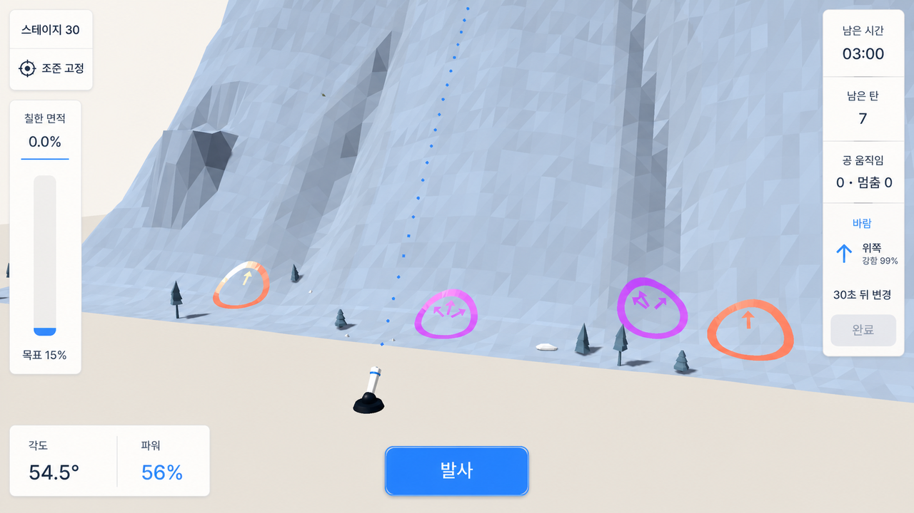

# Paint Mountain Visual References

## Purpose

Register the visual evidence used by Paint Mountain and state what each source
can and cannot decide. This document prevents historical captures, generated
concepts, or asset previews from silently becoming product requirements.

## Sources

### Primary target comparator

- Image: [primary target comparator](../../docs/handoffs/gameplay-visual-reset-2026-08-03/visuals/01-target-reference.png)
- Provenance: original user-supplied design reference.
- SHA-256:
  `1E32C82DF16DBE0809458DC7A7D9385C7EB3A61D0240BD8551B40F02190E4538`
- Use for: dominant thick low-poly mountain, layered terraces and routes, small
  cannon, sparse HUD, paint contrast, mechanism readability, bright restraint,
  and overall visual ambition.
- Do not copy: literal mountain topology, mechanism locations, English copy,
  horizontal coverage bar, bottom-right Restart, exact painted state, or implied
  physics. Later accepted UI decisions supersede those image details.

### Secondary concept board

- Gallery: [generated outcome concept board](../../docs/concepts/execplan-outcome-2026-08-03/index.html)
- Images: `../../docs/concepts/execplan-outcome-2026-08-03/01_stage_progression.png`
  through `07_stage3_clear.png`.
- Use for: warm off-white palette, faceting, apparent thickness, wall join,
  composition options, camera depth, Korean UI tone, and state readability.
- Do not use as: a runtime screenshot, feasibility proof, literal geometry,
  exact HUD contract, stage seed, mechanism placement, or acceptance evidence.

### Historical aiming-HUD direction

- Image: [Command Columns HUD](../../docs/concepts/ui-layout-directions-2026-08-06/command-columns-hud.png)
- Provenance: generated from the current Stage 30 running render and selected by
  the user on 2026-08-06 for implementation.
- SHA-256:
  `1B4AF8DDFF91D5A23238296EC3C886F17CA18E2FC00F2FA93811B50EEEEDCA0F`.
- Historical use: the aiming HUD's narrow command/status columns,
  bottom-center Fire action, warm restrained panel treatment, and compact Korean
  typography rhythm.
- Historical runtime/spec details omitted or simplified in the image included
  focusable Gear, direction value, power-step controls, Aim Lock/Map Inspection,
  dynamic weather detail, disabled/readiness states, and authoritative live
  values. These are not current requirements.
- Do not use as: world-render authority, literal stage/mechanism placement,
  runtime proof, a reason to fake state, or permission to remove functionality.
- Status: superseded on 2026-08-08 by the user's casual shared UI direction.
  Preserve only the still-valid real actions and edge-first hierarchy recorded
  in `UIUX_GUIDELINES.md`; do not preserve the literal columns, panel details,
  or the weather instrumentation retired on 2026-08-09.
- The sibling `quiet-edge-hud.png` and `instrument-rail-hud.png` remain historical
  alternatives, not active directions.

### Historical anti-reference

- Image: [rejected historical build](../../docs/handoffs/gameplay-visual-reset-2026-08-03/visuals/02-current-build.png)
- Provenance: user-supplied capture of the rejected build.
- SHA-256:
  `AEDE8587A122B1977AE4C87FA551E8CE6383AC94B0A9D3EE39024E29F184E173`
- Use for: detecting recurrence of the gray wall/mound, card-like depth,
  dominant flat foreground, oversized black cannon, weak route/mechanism
  visibility, oversized trajectory dots, and legacy HUD hierarchy.
- Do not use as: proof of the current revision or a layout to preserve.

### Current exploratory casual UI matrix

- Gallery: [Casual UI Directions](../../docs/concepts/casual-ui-directions-2026-08-08/index.html)
- Images: `../../docs/concepts/casual-ui-directions-2026-08-08/01-paper-toy-main-menu.png`
  through `09-field-guide-aim-view.png`.
- Provenance: nine independent ImageGen outputs grounded in the matching
  running-game capture and the primary target comparator.
- Use for: comparing three component languages across Main Menu, Stage Select,
  and Aim View: Paper Toy Adventure, Sticker Arcade, and Quiet Field Guide.
- Historical recommendation: borrow Paper Toy's tactile surfaces for menus and
  Field Guide's restraint for the gameplay HUD. The later approved Quiet
  Context system below supersedes this recommendation.
- Do not use as: runtime proof, approved implementation authority, a source of
  gameplay values, or permission to add invented actions. The implemented Theme
  and `UIUX_GUIDELINES.md` remained authoritative until the user selected the
  later concept.

### Approved Quiet Context UI system

- Image: [approved Quiet Context UI](../../docs/concepts/full-ui-refresh-2026-08-09/revised-02-context-line.png)
- Provenance: ImageGen revision grounded in the current running Stage 30 Aim
  View, selected explicitly by the user on 2026-08-09.
- SHA-256:
  `715DA06D3825E97B0C89975153289ECC0BF11F41A9C93A5129DC8397E2DDC33A`.
- Current use: direct edge-aligned status, warm paper-white field, navy type,
  blue primary action, left coverage rail, centered Fire, right-side
  angle/power instruments, hairline separation, minimal containment, and one
  quiet lower-edge context legend with inline input/action pairs.
- Apply across: Main Menu, Stage Select, Briefing, Aim View, Map View, Shot
  Follow, Pause, Settings, transient feedback, and Result using the same Theme,
  spacing, divider, action, focus, and disabled-state principles.
- Preserve beyond the still: real Gear, Finish, loading/failure, Map/Follow,
  focus, localization, settings, and result behavior even when the generated
  image omits or simplifies them.
- Do not copy: generated mountain/glyph placement, fake state, missing actions,
  text artifacts, or exact pixels that conflict with responsive layout. Do not
  retain detached dark keycap tiles or visible target-derived yaw.
- Status: approved visual authority for the UI system. Running-build captures
  remain required implementation and acceptance evidence.

### Historical remediation report

- Report: [historical remediation report](../../docs/remediation-report.html)
- Use for: prior diagnosis and approved-asset research context.
- Do not use as: current visual authority. Candidate previews and generated
  images remain procurement or exploration evidence.

### Textual sources

- `../../docs/source-brief.md`: baseline product and presentation requirements.
- `../../docs/design-spec.md`: working UI, art, camera, and interaction interpretation.
- `../execplans/2026-08-03-gameplay-visual-reset.md`: active
  implementation sequence and currently accepted composition details.
- `../../docs/asset-licenses.md`: approved local asset and license record.
- `../../resources/ui/paint_mountain_theme.tres`: current implemented UI token
  owner, not independent design authority.

## Findings

- The target direction is a bright, faceted, deliberately designed puzzle
  mountain with visible depth layers, not a realistic mountain and not a flat
  height strip.
- Route readability is structural: shelves, terraces, valleys, slopes,
  mechanisms, camera, shadows, and paint must form one legible composition.
- Blue paint and trajectory provide the strongest saturated gameplay contrast;
  environment and UI stay restrained.
- The HUD is visually secondary and edge-aligned. Its current canonical
  behavior and component rules come from `UIUX_GUIDELINES.md`; the approved
  Quiet Context image supplies the visual hierarchy while running code and
  active specs preserve real behavior.
- Existing screenshots and scenes can be useful implementation evidence while
  still being wrong as design direction.

## Recommendations

- Start every comparison with the written art or UI spec, then use the primary
  target to judge direction and the rejected capture to catch regressions.
- Name the exact quality being borrowed from an image—such as mass, depth,
  hierarchy, palette, or readability—rather than saying only "match the
  reference."
- If a new user-approved image changes the direction, register its provenance
  here and update the relevant spec. Adding an image alone does not change the
  contract.
- Keep generated concepts clearly labeled and separate from running-build
  evidence.

## Limitations

- A single view cannot prove watertight geometry, parallax, collision, physical
  response, continuous paint, hidden overlap, or responsive UI.
- Generated images may contain impossible geometry, inconsistent object scale,
  fake labels, or interactions Godot does not implement.
- The primary target predates the accepted vertical coverage, centered Fire,
  and gear-owned Restart layout.
- This register does not itself authorize visual testing or establish that the
  current build matches any source.
