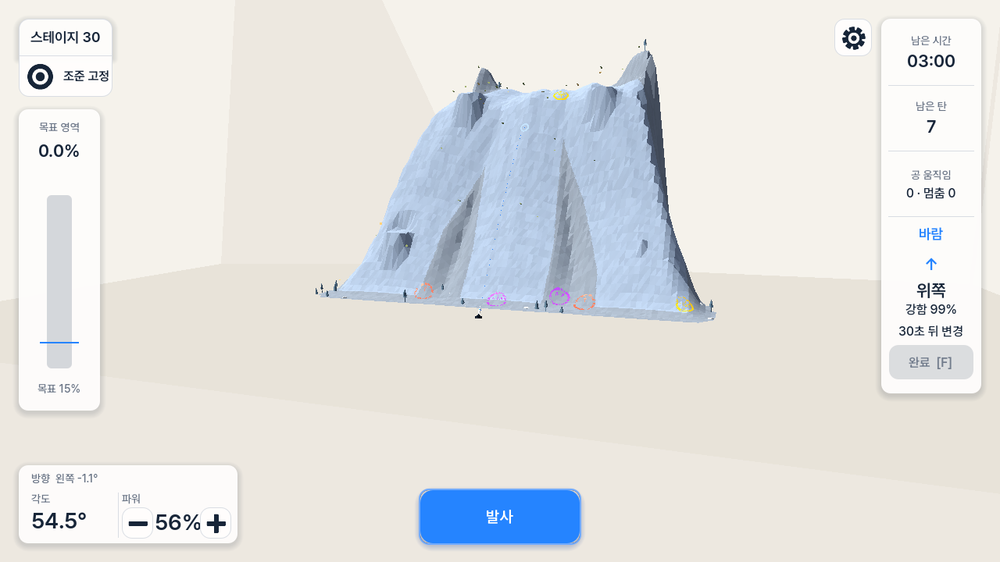
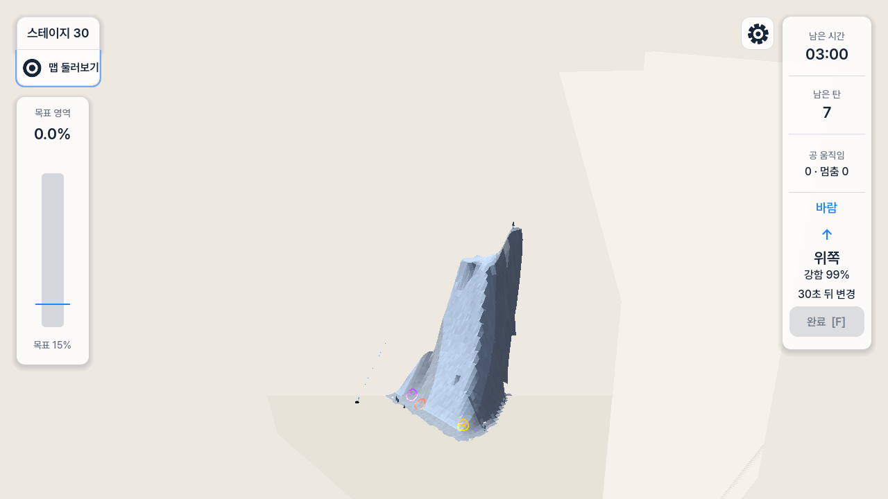

# Aim, Responsiveness, and Product Audit

## Purpose

Preserve the evidence needed to fix the user's current gameplay complaints in a
fresh session. This report separates observed behavior, confirmed code paths,
code-based causal inference, historical provenance, and product recommendations.
It is not an implementation plan or proof that the proposed interaction design
has user approval.

## Sources

- Current user report: aiming still feels excessively constrained; play stutters;
  top/map interaction and ordinary buttons appear to stall for one to two
  seconds.
- Current exported build:
  `builds/windows/PaintMountain.exe`, last built 2026-08-07 01:39 KST.
- Current-run captures:
  - `aim-performance-handoff-2026-08-07/01-stage-30-aim-lock.png`, SHA-256
    `D1E026B6DF932D2B961A542A503C54BF1E5DD6810D5F8C34A4A57AF90CAA74FA`.
  - `aim-performance-handoff-2026-08-07/02-stage-30-map-inspection.png`, SHA-256
    `F94C142C6BBCCBFE53C7DDB79A69A56684946DA4A3779B1C94187D2CF016B64E`.
- Current repository source, `git blame`, recent commits, plan lifecycle metadata,
  and the dirty worktree at implementation baseline `6e820b2`.
- Prior-session provenance:
  - `C:\Users\BK\.codex\sessions\2026\08\02\rollout-2026-08-02T19-56-33-019fc21e-4a9d-7be0-9096-db4cd4cbde09.jsonl`.
  - `C:\Users\BK\.codex\sessions\2026\08\06\rollout-2026-08-06T00-37-15-019fd292-5e50-7f50-ab06-76edd2f5a26b.jsonl`.
- Official comparator sources linked in the product-gap section below.

## Audit Scope

This is a combined UX and code-path audit of the aim/inspect loop. It checks the
visible Stage 30 states, interaction ownership, prediction and camera work that
runs on the main thread, plan drift, missing genre affordances, and a bounded
future expansion path. It does not certify frame rate, accessibility compliance,
stage balance, or all-stage playability.

## User Goal and Accessibility Target

The player should be able to inspect the mountain, understand a high or distant
landing point, adjust manual yaw/elevation/power, and Fire without losing context
or waiting for the interface. Keyboard and pointer users need clear mode state,
visible prediction readiness, stable focus, and controls that do not require
fine motor precision or an undocumented gesture.

## Strengths

- The selected Command Columns HUD is implemented with a shared Theme and
  reusable component scenes. Fire remains the only primary aiming action.
- Korean labels, numeric aim state, wind, time, shots, activity, Finish, and
  target-area coverage have clear owners and readable edge placement.
- Aim tuples, stage state, paint coverage, wind, and replay are not calculated by
  HUD components.
- The current legal range is broad: yaw `-80..80`, elevation `10..68`, and power
  `0..100`. The current complaint is therefore not explained by the old narrow
  yaw clamp alone.
- Target Coverage has one authoritative mask and now distinguishes target from
  valid non-target paint. No new evidence in this audit shows a dropped-paint
  counting defect.

## Findings

### 1. Current flow evidence

#### Step 1 — Stage 30 Aim Lock: poor for target acquisition

The HUD hierarchy and focusable controls are readable. The whole mountain is
technically inside the frame, but the fit-all-points correction makes the cannon,
routes, trajectory dots, glyphs, and impact ring very small. Aim Lock provides no
independent orbit, pan, or zoom, so inclusion in the viewport does not produce a
comfortable aiming workspace. This confirms the user's distinction between
"visible somewhere" and "usable while aiming."

#### Step 2 — Stage 30 Map Inspection after refocus/orbit/zoom: poor orientation

This is a reachable inspected pose produced in the current capture run, not a
claim that every inspection pose looks identical. The mountain becomes small and
near edge-on, large wall/support regions dominate, and there is little orientation
help. Aim controls and Fire disappear because this mode blocks them by contract.
The visible mode label and focus treatment are strengths, but the mode change
creates a high context-switch cost.

Screenshot evidence cannot measure the reported one-to-two-second delay. The
delay analysis below is based on the user's runtime observation plus current
code-path evidence.

### 2. The aiming restriction is an interaction contract, not only a range bug

`AimInputController._can_adjust_aim()` requires `CameraDirector.aim_is_locked()`
(`src/input/aim_input_controller.gd:182-187`). In Map Inspection, left click
refocuses the camera and left drag orbits it; it never places a ballistic target
(`src/camera/camera_director.gd:119-150,472-485`). Map Inspection also blocks aim
and Fire by the 2026-08-06 source-brief contract.

Commit `fb08292` intentionally introduced this split. The result is internally
consistent but too restrictive in practice:

- Aim Lock can edit the shot but cannot inspect the view.
- Map Inspection can inspect the view but cannot edit or Fire the shot.
- Terrain click changes camera focus, not the aim tuple.
- Returning to Aim Lock restores one fixed composition and discards inspection
  framing, although it preserves the numeric aim.

The new 2026-08-07 source-brief clarification rejects this as sufficient. It
preserves manual yaw/elevation/power and does not authorize an inverse
click-to-target solver.

### 3. Ranked latency causes

| Priority | Cause and causal chain | Confidence |
| --- | --- | --- |
| P0 | While wind is running, `WindController._physics_process()` emits `snapshot_changed` every 60 Hz tick (`src/wind/wind_controller.gd:72-78`). `GameplayScene._on_wind_snapshot_changed()` always sets `_prediction_dirty` (`src/gameplay/gameplay_scene.gd:381-383`). The scene can therefore run the full synchronous predictor every 50 ms (`src/gameplay/gameplay_scene.gd:147-154,310-328`). | High |
| P0 | Every Fire request calls `CannonController.refresh_prediction_for_fire()` before readiness is checked (`src/stage/stage_controller.gd:317-328`). The callback immediately invokes the same full predictor (`src/cannon/cannon_controller.gd:73-80`). This places heavy work directly in the button/Space call stack. | High |
| P1 | One prediction can execute 720 fixed-step `cast_motion` physics queries (`src/cannon/trajectory_predictor.gd:4-5,65-82`). The preserved uncommitted recovery diff adds an endpoint `get_rest_info` query to nearly every no-hit step (`src/cannon/trajectory_predictor.gd:85-115`), approaching two physics queries per step. | High |
| P1 | Power-button hold repeats every 80 ms and each accepted change invalidates prediction. This amplifies the P0 path rather than coalescing settled intent (`src/ui/hud/aim_controls.gd:30-36`, `src/input/aim_input_controller.gd:47-60`). | High |
| P1 | Map-to-Aim calls `_safe_aiming_bookmark()`, duplicates all cached top points, scans maxima, and calls `summit_region()` again (`src/camera/camera_director.gd:310-400`). Stage 30 can scan up to 12,288 top triangles and sort Dictionary records (`src/stage_generation/generated_stage_layout.gd:270-313`). | Medium-high; not timed |
| P2 | Map click itself is one raycast, but dirty camera poses can invoke up to eight safety rays and more transitional rays during smoothing (`src/camera/camera_director.gd:275-302,541-571`). | Medium |
| P2 | Wind debris performs terrain queries and MultiMesh updates for 36-60 instances every physics tick. It can add allocation/CPU pressure after the first Fire but does not explain a one-to-two-second single stall by itself. | Low-medium |
| Conditional | Stage selection still builds preview geometry/material/dressing and a 256-square preview image on the main thread. Existing exported entry measurements were about 1.0 s for Stage 01 and 2.1 s for Stage 30. This applies if "placement" refers to selection/preview rather than in-game Map Inspection. | Medium |

At 20 predictions per second, the current upper bound is 14,400 shape casts per
second before the additional rest probes. The actual count stops at first hit or
bounds exit, but the architecture permits sustained main-thread query churn.

### 4. This is a regression over a previously identified rule

The superseded visual-reset plan still contains one valuable historical finding:
Phase 10 identified the same launch hitch and locked the rule that Fire must
never perform prediction (`.agents/execplans/2026-08-03-gameplay-visual-reset.md:1017-1041`).
Its measured older path rejected stale Fire in `0.002 ms` and accepted ready Fire
in `1.255 ms`.

Later wind integration regressed that contract:

| Commit | Relevant change |
| --- | --- |
| `fb08292` | Added the mutually exclusive Aim Lock/Map Inspection input model. |
| `08b7458` | Added 60 Hz wind snapshots. |
| `d689a72` | Added per-step wind sampling to trajectory prediction and a prediction-refresh callback. |
| `b3612f4` | Reintroduced synchronous prediction inside every Fire request. |
| `5b744f4` | Connected every wind snapshot to prediction invalidation. |

The current stutter is therefore primarily a wind/prediction scheduling
regression layered onto an intentionally restrictive camera/input contract. It
is not caused by a missing target-wide reachability certificate.

### 5. Meaning of the existing trajectory/reachability changes

The earlier phrase "existing trajectory/reachability related incomplete changes"
was imprecise. It means **uncommitted, provenance-incomplete recovery experiments
in the worktree**, not an unfinished current product requirement.

The six pre-existing modified files contain 388 insertions and 218 deletions:

- `.agents/evidence/2026-08-05-gameplay-contract-gap-audit.md`
- `.agents/execplans/2026-08-05-gameplay-contract-recovery.md`
- `src/cannon/trajectory_predictor.gd`
- `src/stage_generation/direct_reachability_certificate.gd`
- `src/stage_generation/direct_reachability_validator.gd`
- `tests/target_mask_test.gd`

The code experiments add endpoint-rest collision probes, bounded `+-0.5` degree
yaw retries, relaxed certificate witness-reference bookkeeping, and target-mask
policy changes. Untracked v7 catalogs, probes, and screenshots accompany them.
The active catalog pointer is committed v8, so those v7 directories are not
production authority.

Prior-session evidence confirms partial, long-running recovery work:

- Session line 42009 records the bounded yaw retry; line 42609 records the
  endpoint-rest patch.
- Line 44364 reports a Stage 30 worker that took about 762,813 ms for predictor
  work and 226,733 ms for rigid-body work, while explicitly leaving other stages
  next.
- Line 44809 still shows a dirty worktree; lines 45018-45019 leave the complete
  catalog/export/render gates open.
- The later Aug 6 session at line 1321 committed only ballistic preparation as
  `19f2d45` and explicitly preserved the stopped session's remaining files
  uncommitted.

The 2026-08-06 Practical Stage Validation supersession now says exhaustive
per-target predictor/rigid-body certification is not a product, release, or
standing-test obligation. `DirectReachabilityCertificate` is optional diagnostic
metadata. Default and summit first-hit witnesses remain. No authored success
route, solver clear, or all-stage manual playthrough is required.

### 6. Past-plan lifecycle audit

| Plan group | Current use |
| --- | --- |
| Seven plans dated Aug 3-5 with `status: superseded` | Historical context only. Their unchecked boxes are not remaining work. Do not revive the old solver, success-route, three-stage, camera-preset, or target-wide certificate contracts. |
| `2026-08-06-aim-view-and-coverage-opportunity.md`, `status: archived` | Do not execute. It was an exploratory predecessor and explicitly excluded the interaction change now requested. |
| `2026-08-06-ballistic-terrain-preparation.md`, `status: done` | Retain analytic range admission and prepared catalog architecture. Do not treat it as proof of responsive buttons or exact first-hit coverage. |
| `2026-08-06-wind-driven-coverage-loop.md`, `status: done` | Retain persistent balls, wind truth, timed Finish, surface glyphs, and one paint authority. Reopen only the prediction scheduling regression introduced by that integration. |
| `2026-08-06-fast-stage-entry-and-fire-capacity.md`, `status: done` | Retain persisted layouts, bounded LRU, and no runtime generation. Existing 1.0/2.1 s cold entry measurements show that responsive loading presentation remains relevant. |
| `2026-08-06-command-columns-hud.md`, `status: done` | Retain the shared Theme/components and selected edge layout. It does not prove camera or interaction acceptance. |
| `2026-08-07-target-coverage-and-safe-aim-framing.md`, `status: done` | Retain target-area copy, shader threshold alignment, and cached canonical top points. The user has rejected the resulting fixed framing as a sufficient aiming experience, so a new plan must replace that UX without rewriting its completed history. |

One stale implementation artifact remains: `scripts/test.ps1` still runs
`phase6_solution_test.gd` in its normal complete suite even though the source
brief retired prescribed successful routes. The test must either be removed from
the normal gate or explicitly reclassified as an optional diagnostic; do not
spend the next session repairing solver clears.

### 7. Current codebase quality risks

| Risk | Consequence | Safer ownership direction |
| --- | --- | --- |
| Prediction scheduling is embedded in `GameplayScene` and invalidated by a broad presentation signal. | HUD wind updates, aim changes, Fire admission, physics queries, and preview readiness can trigger each other accidentally. | Add one `TrajectoryPredictionScheduler`-shaped owner for dirty keys, cadence, cache, time budget, and publish/readiness. Keep physics queries on the main thread unless Godot explicitly permits another path. |
| `WindController.snapshot_changed` represents both 60 Hz presentation and launch-relevant prediction state. | Every HUD update becomes an expensive gameplay invalidation. | Separate display snapshots from a coarser prediction epoch or compare a canonical prediction key before invalidating. |
| Fire admission calls back into a heavyweight computation. | An action that should be constant-work can stall the UI and all action origins. | Fire reads a ready immutable prediction key only; stale state becomes immediately visible pending/disabled state. |
| Camera framing owns uncached topology-derived work on every mode change. | A UI toggle scales with terrain complexity and allocates arrays/dictionaries. | Precompute immutable aim interest/summit points and the authored safe pose once per layout/camera input set. |
| Stage-select preview construction still creates render artifacts and texture pixels on selection. | Cold navigation can remain unresponsive even though layout I/O moved off the main path. | Bake/cache preview artifacts or present an immediate selection state while bounded preview work completes. |
| `DirectReachabilityValidator` is 1,671 lines although exhaustive certification is optional. | Dormant diagnostic policy remains expensive to understand and easy to pull back into runtime/release work. | Keep only bounded default/summit APIs on the normal path; isolate exhaustive certificate tooling and its tests as optional offline diagnostics. |
| Current implemented-status prose contains claims from different revisions. | Old "stutter resolved" or "unfinished certificate" statements can override newer code/user evidence. | Treat source brief and current code as authority; keep one current record at the top of `.agents/Documentation.md`; leave old plan outcomes historical. |
| The worktree mixes stopped recovery edits with stale v7 outputs and later v8 production. | A broad commit could accidentally ship expensive experiments or stale catalogs. | Never stage/revert the pre-existing dirty set as a group. Establish ownership and reproduce each change before keeping or discarding it. |

## Accessibility Risks

- Aim Lock and Map Inspection use text plus icon/focus state, which is stronger
  than color-only communication.
- After the transient first-session hint expires, the extra interaction behavior
  is not discoverable on screen. A new camera gesture needs a tooltip/hint and a
  keyboard equivalent.
- There is no implemented aim-sensitivity or key-rebinding setting. Keyboard
  aiming exists, but pointer users cannot tune the drag scale and controller
  support is not exposed.
- A disabled Fire state must explain whether the cause is capacity, invalid hit,
  or prediction pending without relying only on color.
- The screenshot set cannot prove keyboard traversal order, focus retention
  through mode changes, screen-reader semantics, or motion sensitivity.

## Opportunity Areas from Comparable Games

These are transferable interaction patterns, not requests to copy the comparator
games' business models or content volume.

| Priority | Pattern and official evidence | Paint Mountain gap or opportunity |
| --- | --- | --- |
| P0 | Team17's official [Worms W.M.D Mobilize overview](https://www.team17.com/news/worms-w-md-mobilize-out-now-on-apple-android) describes aim/power controls, wind and turn information, camera follow plus manual pan/zoom, training, and editable controls. | Let camera inspection coexist with deliberate aim, keep wind/time/shot state readable, and add sensitivity/remapping after the core latency fix. Do not import the large weapon set or multiplayer scope. |
| P0 | Rovio treats the trajectory line as core enough to call out a portal-specific fix in the official [Angry Birds 2 4.0 update](https://www.angrybirds.com/stories/angry-birds-2-update-4-0-0/). | Prediction readiness and the first-impact marker must respond quickly and remain trustworthy across high arcs and occlusion. |
| P0 | Rovio's official [Angry Birds AR announcement](https://www.rovio.com/articles/rovio-and-resolution-games-reveal-first-angry-birds-mobile-ar-game-angry-birds-ar-isle-of-pigs/) describes walking around a 3D level to find weaknesses and then lining up a shot. | Provide independent 3D inspection and a fast return to aim; do not copy AR movement itself. |
| P0/P1 | Nintendo's official [Splatoon 3 beginner guide](https://www.nintendo.com/en-gb/News/2024/December/Beginner-basics-for-Splatoon-3-the-ins-and-outs-of-playing-online-2645154.html) uses a map to read inked territory. | A compact authoritative target-area map/heat view can explain painted target, painted non-target, and remaining target without changing coverage authority. PvP is not transferable. |
| P1 | Afterburn's official [Golf Peaks page](https://afterburn.itch.io/golf-peaks) describes more than 120 handcrafted stages and a relaxed textless tutorial. | Add a short practice/tutorial sequence that teaches aim axes, wind, persistent balls, and each glyph before relying on a fading control hint. |
| P2 | Team17/Triband's official [WHAT THE GOLF? page](https://www.team17.com/games/what-the-golf) describes hundreds of physics variations and a level editor/community direction. | Expand first through recombinations of terrain, wind, target masks, and glyph rules. A local editor would require a later explicit revision of the current no-UGC scope. |

Existing replay, star thresholds, quick restart, settings, open thirty-stage
selection, and trajectory preview should be classified as **present but needing
runtime clarity/performance validation**, not missing features.

## Alternatives

### Aiming and camera

| Option | Benefit | Cost/risk | Decision |
| --- | --- | --- | --- |
| Widen yaw/elevation or FOV only | Small patch | Current tuple is already broad; wider FOV makes the mountain smaller and does not remove the mode tax | Reject as primary fix |
| Click terrain to solve a yaw/elevation/power tuple | Direct target selection | Reintroduces inverse ballistic search, multiple-arc ambiguity, and the solver-heavy direction the user rejected; weakens the manual planning identity | Do not add by default |
| Keep manual aim and add independent Aim Lock camera navigation | Preserves the puzzle, lets the player inspect high/distant impacts, and fits the current architecture | Needs a discoverable non-conflicting gesture, a reset action, and camera-state tests | Recommended |

The recommended starting mapping is left drag for yaw/elevation and wheel for
power as today, plus a separate right- or middle-drag orbit gesture and a
modifier-assisted zoom while Aim Lock remains active. Preserve Tab overview and
provide one-action recenter. The exact gesture remains a user-facing decision for
the next implementation plan.

### Prediction and responsiveness

| Option | Benefit | Cost/risk | Decision |
| --- | --- | --- | --- |
| Only remove the new rest probe or reduce refresh rate | Fast local change | Can break collision parity and leaves Fire/input coupling in place | Insufficient alone |
| Run `PhysicsDirectSpaceState3D` prediction on a worker thread | Keeps the render thread free in theory | Godot physics-space thread safety and deterministic ordering are material risks | Do not choose without primary Godot proof |
| Main-thread budgeted scheduler, canonical keys, and caches | Preserves the real physics owner while preventing input callbacks and 60 Hz presentation signals from launching full work | Requires a clear readiness contract and targeted timing | Recommended |

## Recommendations

1. Record one focused timing trace only: wind-running idle, one-second power
   hold, Fire, map refocus/orbit, Map-to-Aim, and stage selection if the user's
   "placement" means stage preview. Capture prediction count/time, input-to-
   visible-state time, and camera solve count. Stop after each causal path is
   confirmed; do not run the broad suite.
2. Restore constant-work Fire. A stale aim/wind prediction must return pending or
   disabled immediately; Fire must not call prediction.
3. Separate 60 Hz wind presentation from prediction invalidation. Key prediction
   by the canonical aim tuple, wind schedule identity, and a deliberately bounded
   launch-time bucket/epoch. Keep the HUD smooth without recomputing collision
   every snapshot.
4. Keep endpoint collision parity but move exhaustive/offline probes out of the
   default gameplay loop, or guard them with a cheap canonical terrain/containment
   proximity test. Measure before choosing an incremental predictor.
5. Cache playable-top/summit interest data and the authored safe Aim pose once per
   stage/layout/view input. A mode toggle must not scan terrain topology.
6. Implement independent Aim Lock camera navigation only after P0 hitches are
   removed, so UX review is not contaminated by latency.
7. After the code units are stable, run only focused prediction parity and camera
   interaction checks, then one `scripts/verify.ps1`, one release export, and the
   final running-game captures. User foreground play remains the decisive feel
   check.
8. Add learnability and mastery features next: short practice stages, a target-
   area map/heat view, last-shot comparison, sensitivity/remapping, and optional
   local stage challenges. Delay new projectile classes and online systems; an
   editor requires a later explicit scope change.

## Limitations

- No profiler or interaction timestamp instrumentation ran in this audit. The
  one-to-two-second value is the user's direct runtime report; code confidence
  does not substitute for measured duration.
- The capture runner establishes visible current states but does not simulate the
  user's exact pointer timing or prove all camera poses.
- The exported executable includes the pre-existing dirty trajectory predictor
  because that file predates the export. It does not include later documentation
  changes, which do not affect runtime.
- Comparator sources support patterns, not a claim that every listed feature is
  mandatory for Paint Mountain.
- The recommended extra Aim Lock gesture has not yet been approved by the user.
