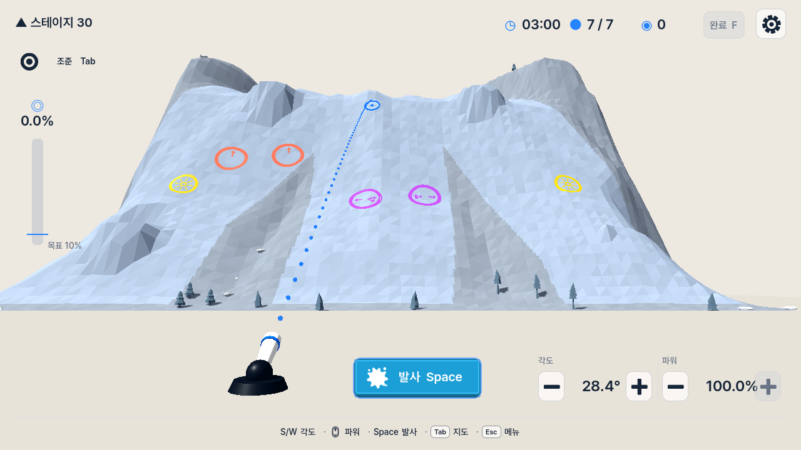

# Wind Retirement Evidence

## Purpose

Prove that the current build has no active wind contract while preserving the
persistent-ball, mechanism, stage-clock, Finish, coverage, terrain-seed, and
gravity/collision prediction loop. This evidence does not claim measured
performance savings or that the removed implementation had no mechanical
effect.

## Automated and Source Evidence

- Exact source scans found no live `Wind*` type, wind resource path, schedule,
  force, gust, strong-episode, HUD, capture, or test identifier under the
  current runtime, scenes, resources, tests, translations, or scripts.
- Projectile settling, mechanism wake, attempt schema 3, terrain-seed truth,
  prediction scheduling, terrain aiming, aim interaction, Stage 10 readiness,
  UI flow, localization, HUD truth, shot feedback, shortcuts, debug export,
  projectile/prediction parity, and long-flight parity checks passed.
- `scripts/verify.ps1` passed project import, script parsing, and main-scene
  startup with Godot 4.7.1.
- The Windows Desktop release export completed with exit 0. A clean rebuild of
  Godot's generated export cache removed stale pre-removal binary conversions.
- The exported application captured Stage 30 Aim View at 1280x720 in Korean
  with exit 0 and empty stderr. Runtime output is saved beside the image.

## Rendered Review

- The top-right run status contains time, remaining/maximum shots, resident
  activity, Finish, and Settings without an empty instrument gap.
- Text, buttons, trajectory, target marker, mountain, mechanisms, and cannon
  remain visible without clipping or overlap at 1280x720.
- No retired HUD instrument, cannon-side flag, debris field, or other wind cue
  is visible.

## Repository-Suite Limitation

The repository-wide `scripts/test.ps1` run reached and passed the affected
runtime and catalog checks, but the runner remains non-zero because two
unchanged baseline tests are stale: `phase6_content_test.gd` still expects
legacy stage IDs and `camera_safety_test.gd` refers to the absent
`CameraDirector.AIM_FRAME_MARGIN` constant. The same expectations are present
in `HEAD`; neither test nor its production owner was changed by this task.
Tests after that runner barrier that reach the changed HUD, observation, and
prediction contracts were executed directly and passed.

## Files

- `release-aim-stage30-1280x720-ko.png`: inspected exported-game capture.
- `release-aim-stage30-1280x720-ko.stdout.log`: successful capture output.
- `release-aim-stage30-1280x720-ko.stderr.log`: empty error stream.

