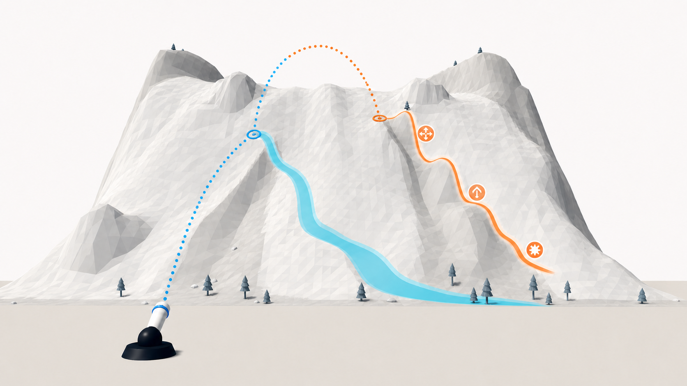

# Paint Mountain 단계별 난이도 설계

## 먼저 결론부터

최종안은 **대비형 선택 경로 사다리(Contrastive Risk-Route Ladder)**입니다.

핵심은 산을 계속 높이거나 목표 수치만 올리는 것이 아닙니다. 플레이어가
한 가지 원리를 눈으로 확인하고, 비슷한 두 스테이지의 차이를 비교하고,
그 원리를 다른 지형에 적용한 뒤, 마지막에는 이전 원리와 합쳐 쓰게
만듭니다.

각 중후반 스테이지 안에는 다음 두 가지 선택지도 함께 둡니다.

- 폭이 넓고 실패 후에도 이어가기 쉬운 **안정 경로**
- 폭은 좁지만 기믹과 경사 반전을 더 많이 활용할 수 있는 **도전 경로**

플레이어는 발사 전에 현재 도색 상태, 남은 발사 수, 예상 첫 충돌 지점,
기믹 순서를 보고 둘 중 어느 쪽이 이번 발사에 더 나은지 결정합니다.

이 문서는 **구현할 설계와 작업 방법을 풀어쓴 문서**입니다. 아직 현재
빌드에 구현된 기능을 설명하는 문서는 아닙니다.

## 지금 방식에서 무엇이 부족한가

현재 게임은 뒤 스테이지로 갈수록 다음 값이 함께 변합니다.

- 목표 도색률
- 발사 가능 횟수와 제한 시간
- 산의 크기와 굴곡
- 경로 수와 경로 폭
- 오르막·내리막 반전 수
- Burst, Splitter, Uphill Rebound의 수

수치상으로는 뒤 스테이지가 더 어렵습니다. 그러나 여러 값이 동시에
바뀌면 플레이어가 실패 원인을 구분하기 어렵습니다.

예를 들어 공이 목표 지점을 벗어났을 때 다음 질문에 답하기 어렵습니다.

- 처음 닿은 위치가 잘못되었나?
- 경로가 너무 좁았나?
- 오르막 전환을 예상하지 못했나?
- Splitter와 Burst의 순서를 잘못 읽었나?
- 원래 한 발로 너무 많은 면적을 노렸나?

따라서 새 설계에서는 “스테이지 번호가 높으니 모든 값을 올린다”가 아니라
**이번 스테이지에서 무엇을 바꾸고, 무엇을 일부러 그대로 둘지**를 먼저
정합니다.

## 플레이어가 실제로 보게 될 선택



> 위 그림은 설계를 설명하기 위한 개념도입니다. 실제 게임에는 청록색·주황색
> 경로선, 경로 이름, 정답 화살표를 표시하지 않습니다. 실제 플레이에서는
> 산의 폭과 굴곡, 평평한 기믹 문양, 현재 궤적 미리보기를 보고 경로를
> 스스로 읽습니다.

그림에서 두 점선은 **서로 다른 발사 후보**입니다. 점선은 각각 첫 충돌
지점에서 끝납니다. 첫 충돌 뒤에는 공이 지형을 따라 움직이며 계속 칠합니다.
발사 후 방향을 바꾸는 기능은 없습니다.

- 청록색 쪽은 넓고 완만합니다. 첫 충돌이 조금 빗나가도 경로 안에 남을
  가능성이 높습니다. 한 번에 큰 연쇄를 만들기는 어렵지만 결과를 예측하고
  다음 발사를 수정하기 쉽습니다.
- 주황색 쪽은 좁고 경사 방향이 바뀝니다. 기믹을 더 많이 거칠 수 있어
  넓은 도색 기회를 만들 수 있지만, 첫 충돌과 진입 각도가 틀리면 경로를
  일찍 벗어날 수 있습니다.

어느 쪽도 공식 정답은 아닙니다. 안정 경로도 자동 클리어를 보장하지 않고,
도전 경로도 항상 더 높은 도색률을 보장하지 않습니다. 두 경로는 플레이어가
비교할 수 있는 **구조적 기회**입니다.

## 한 번의 플레이가 어떻게 달라지는가

예를 들어 12번 스테이지를 다음과 같이 구성합니다.

1. 플레이어가 산을 살펴보면 넓은 왼쪽 경로와 좁은 오른쪽 경로가 모두
   보입니다.
2. 왼쪽 경로는 기믹이 적고 경사가 부드럽습니다. 첫 발을 안정적으로
   쌓고 싶을 때 유리합니다.
3. 오른쪽 경로는 최소 4m 더 좁고, Splitter 뒤에 Burst가 이어지거나
   오르막 반전이 하나 더 있습니다.
4. 플레이어가 오른쪽을 선택하면 궤적 미리보기로 **첫 충돌까지만** 확인한
   뒤 발사합니다.
5. 공이 Splitter에 닿지 못하고 오른쪽 어깨로 빠졌다면 실패 원인은
   “운이 나빴다”가 아니라 “첫 충돌이 경로 중심보다 오른쪽이었다”가 됩니다.
6. 다음 발사에서는 목표 지점을 왼쪽으로 옮기거나, 각도를 높여 더 위에서
   진입하거나, 안정 경로로 계획을 바꿀 수 있습니다.
7. 첫 발이 도전 경로에서 넓게 칠했다면 다음 발은 이미 칠한 곳과 겹치지
   않는 안정 경로를 노릴 수 있습니다.

즉, 난이도는 버튼 입력이 어려워지는 데서 오지 않습니다. **발사 전에
비교해야 할 가설이 많아지고, 한 발의 결과를 다음 발 계획에 이용해야 하는
정도**가 높아집니다.

## 세 기믹은 난이도에서 어떤 역할을 하나

새 기믹을 추가하지 않고 현재 세 종류의 순서와 위치를 바꿉니다.

| 기믹 | 실제 역할 | 난이도에 쓰는 방법 |
| --- | --- | --- |
| Burst | 해당 지점에 넓은 원형 페인트를 남기고 들어온 공을 소비함 | 좁은 경로 끝의 큰 보상 또는 안정 경로의 확실한 마무리로 사용 |
| Splitter | 들어온 공을 소비하고 세 개의 자식 공으로 나눔 | 경로가 갈라지는 위치 앞뒤에 놓아 분산 방향을 계획하게 함 |
| Uphill Rebound | 공을 의미 있는 오르막 방향으로 되돌림 | 내려가기만 하던 예상을 깨고, 반전 뒤의 두 번째 도색 기회를 만듦 |

난이도는 단순히 기믹 수가 많아져서 생기는 것이 아닙니다. 같은 두 기믹도
순서가 바뀌면 다른 문제가 됩니다.

- **Burst → Splitter**: Burst가 먼저 공을 소비하므로 같은 공으로 뒤의
  Splitter까지 갈 수 없습니다. 어느 기믹에 진입할지를 선택해야 합니다.
- **Splitter → Burst**: 나뉜 자식 공이 여러 방향으로 퍼지면서 뒤의 Burst
  기회를 노릴 수 있습니다. 대신 자식 경로를 읽어야 합니다.
- **Uphill Rebound → Splitter**: 오르막 반전 뒤에 분산이 생기므로 진입
  속도와 방향을 더 길게 예상해야 합니다.

실제 유효한 연쇄는 현재 물리와 기믹 소비 규칙으로 확인합니다. 문서에 적은
순서가 실제 공의 접촉 순서로 성립하지 않으면 지형이나 기믹 위치를
고칩니다. 물리 규칙을 바꿔 문서에 억지로 맞추지는 않습니다.

## 30개 스테이지를 어떻게 구성할 것인가

30개 스테이지를 6개씩 다섯 묶음으로 나눕니다. 모든 스테이지는 계속
처음부터 열려 있습니다. 아래 순서는 잠금 조건이 아니라 제작자가 지켜야
하는 학습 구조입니다.

각 묶음은 같은 여섯 역할을 반복합니다.

1. **기준**: 새 원리를 가장 단순한 형태로 보여줍니다.
2. **대비 A**: 한 가지 축을 바꾸고 다른 축은 최대한 유지합니다.
3. **대비 B**: 같은 원리의 반대 선택이나 두 번째 값을 보여줍니다.
4. **전이**: 배운 원리를 다른 지형 모양에 적용합니다.
5. **섞기**: 이전 묶음에서 배운 기술 하나를 다시 사용합니다.
6. **종합**: 현재 묶음의 기술과 이전 기술을 함께 요구합니다.

아래 표는 **구현 기준이 되는 스테이지 청사진**입니다. 정확한 좌표와 경사
수치는 전체 카탈로그 생성과 실제 플레이 검증 중 조정할 수 있지만, 각
스테이지가 무엇을 가르치고 무엇을 비교하게 하는지는 바꾸지 않습니다.

### 1묶음 — 접촉과 하강: 스테이지 01-06

| 번호·역할 | 구체 구성 | 플레이어가 판단할 것 |
| --- | --- | --- |
| 01 기준 | 넓은 단일 내리막, 기믹 없음 | 첫 충돌점이 공의 하강 경로와 연속 도색 길이를 어떻게 바꾸는가 |
| 02 대비 A | 01과 비슷한 폭·반전 수를 유지하고 중앙에 첫 Burst 배치 | 경로를 오래 타는 것과 Burst 원형 도색 중 어느 쪽을 노릴 것인가 |
| 03 대비 B | 폭과 반전 난도는 억제하고 세 갈래 경로와 첫 Splitter 배치 | 한 공의 긴 자국과 세 공의 분산 자국이 어떻게 다른가 |
| 04 전이 | 비슷한 착지 여유를 유지한 채 경로를 옆으로 휘게 구성 | 같은 충돌 원리를 정면이 아닌 측면 진입에도 적용할 수 있는가 |
| 05 섞기 | 완만한 경사 반전과 회복 분지를 추가 | 첫 충돌 뒤 방향이 한 번 바뀌어도 흐름을 계속 예측할 수 있는가 |
| 06 종합 | 고개 하나와 두 기믹 기회를 결합 | 긴 하강, 분산, 원형 도색 중 이번 발에 필요한 결과를 고를 수 있는가 |

이 묶음의 목적은 조준 정밀도를 시험하는 것이 아닙니다. “어디에 먼저
닿으면 그다음에 어떻게 칠하는가”라는 기본 원인을 익히는 것입니다.

### 2묶음 — 경로 선택: 스테이지 07-12

| 번호·역할 | 구체 구성 | 플레이어가 판단할 것 |
| --- | --- | --- |
| 07 기준 | 나란히 보이는 넓은 경로와 좁은 경로, 복잡한 연쇄는 억제 | 안정성과 잠재 도색량 중 무엇을 우선할 것인가 |
| 08 대비 A | 경로 수와 폭 차이는 비슷하게 유지하고 도전 경로에 첫 Uphill Rebound 배치 | 단순 하강과 오르막 반전 중 어느 결과가 필요한가 |
| 09 대비 B | 경로 수·반전 수를 유지하고 폭 차이를 더 분명하게 조정 | 짧고 좁은 고수익 경로가 추가 위험을 감수할 가치가 있는가 |
| 10 전이 | 폭 차이는 유지하되 두 경로의 끝 위치와 휘는 방향을 변경 | 익숙한 선택 원리를 다른 실루엣에서도 읽을 수 있는가 |
| 11 섞기 | 안정/도전 경로에 1묶음의 Burst·Splitter 판단을 다시 결합 | 안전한 한 발과 분산을 노리는 한 발 중 무엇이 현재 도색에 맞는가 |
| 12 종합 | 안정 경로는 도전 경로보다 최소 4m 넓고, 도전 경로에 기믹 지점 또는 반전 하나 추가 | 첫 번째 완전한 안정/도전 선택을 스스로 설명하고 실행할 수 있는가 |

11번과 12번부터는 두 경로가 구조 검사 대상이 됩니다. 둘 다 실제 조준
카메라에서 보여야 하며, 경로 화살표 없이도 폭과 기믹 차이를 읽을 수 있어야
합니다.

### 3묶음 — 반전과 회복: 스테이지 13-18

| 번호·역할 | 구체 구성 | 플레이어가 판단할 것 |
| --- | --- | --- |
| 13 기준 | 넓고 읽기 쉬운 `내리막 → 짧은 오르막 → 내리막` 경로 | 공이 반전 전에 가진 속도로 오르막을 넘을 수 있는가 |
| 14 대비 A | 경로 수와 최소 폭을 유지하고 경사 반전 수를 하나 늘림 | 첫 반전만 볼 것이 아니라 두 번째 반전까지 계획할 수 있는가 |
| 15 대비 B | 반전 수와 폭을 유지하고 빗나간 공을 받을 수 있는 분지를 추가 | 완벽한 진입과 회복 가능한 진입 중 무엇을 노릴 것인가 |
| 16 전이 | 같은 반전·분지 조건을 산의 옆 방향 S자 경로로 이동 | 정면에서 배운 속도 판단을 측면 경로에 적용할 수 있는가 |
| 17 섞기 | 안정 경로에는 넓은 회복 분지, 도전 경로에는 추가 반전 배치 | 2묶음의 경로 선택과 현재의 반전 판단을 함께 할 수 있는가 |
| 18 종합 | 여러 경로, 회복 분지, Uphill Rebound 기회를 결합 | 빗나감까지 포함한 두 번째 계획을 발사 전에 세울 수 있는가 |

여기서 회복은 자동 보정이 아닙니다. 공을 목표로 끌어당기거나 숨은 힘으로
되돌리지 않습니다. 지형이 넓게 받아 주는 곳을 플레이어가 보고 선택하는
것입니다.

### 4묶음 — 기믹 연쇄: 스테이지 19-24

| 번호·역할 | 구체 구성 | 플레이어가 판단할 것 |
| --- | --- | --- |
| 19 기준 | 한 주요 경로에 접촉 순서가 읽히는 두 기믹을 배치하고 나머지 기믹은 다른 경로에 분산 | 기믹 개수보다 먼저 작동 순서를 읽을 수 있는가 |
| 20 대비 A | 경로 수와 반전 수는 유지하고 주요 기믹 순서를 변경 | 같은 지형에서도 Splitter 전후의 Burst 결과가 왜 달라지는가 |
| 21 대비 B | 경로 수와 최소 폭은 유지하고 한 경로의 연속 기믹 지점을 하나 늘림 | 긴 연쇄의 이득이 진입 실패 위험보다 큰가 |
| 22 전이 | 20의 기믹 순서를 유지하되 연쇄를 측면 경로와 경사 반전 위로 이동 | 외운 좌표가 아니라 기믹 순서 원리를 적용할 수 있는가 |
| 23 섞기 | 안정 경로에는 짧은 연쇄, 도전 경로에는 긴 연쇄 배치 | 경로 선택, 반전, 기믹 순서를 한 번에 비교할 수 있는가 |
| 24 종합 | 세 경로에 서로 다른 짧은 연쇄를 두고 한 도전 경로만 추가 반전 또는 기믹 지점을 가짐 | 현재 도색에 맞는 연쇄를 선택하고 실패 원인을 특정할 수 있는가 |

목표는 한 발로 모든 기믹을 밟게 만드는 것이 아닙니다. 여러 가능한 연쇄
중 이번 발에 필요한 하나를 고르게 만드는 것입니다.

### 5묶음 — 종합과 여러 발 계획: 스테이지 25-30

| 번호·역할 | 구체 구성 | 플레이어가 판단할 것 |
| --- | --- | --- |
| 25 기준 | 서로 다른 산면을 칠할 수 있는 두 개의 큰 경로 기회를 분리 | 첫 발과 다음 발의 자국이 겹치지 않게 순서를 정할 수 있는가 |
| 26 대비 A | 경로 수와 반전 수는 유지하고 경로 끝의 간격을 넓힘 | 넓게 분산된 두 기회를 남은 발사 수 안에 어떻게 나눌 것인가 |
| 27 대비 B | 경로 수와 연속 기믹 수는 유지하고 한 경로를 더 좁고 유혹적인 형태로 만듦 | 첫 발의 큰 이득과 전체 시도의 안정성 중 무엇을 택할 것인가 |
| 28 전이 | 26의 경로 간격과 폭 차이를 유지하고 좌우 배치와 휘는 방향을 바꿈 | 외운 방향이 아니라 도색 중복을 줄이는 원리를 적용할 수 있는가 |
| 29 섞기 | 안정/도전 경로에 반전과 기믹 연쇄를 함께 배치 | 이전 네 묶음의 판단을 현재 도색 상태에 맞게 조합할 수 있는가 |
| 30 종합 | 여러 경로, 6개 기믹, 회복 지형, 안정/도전 선택을 모두 보여 주되 화면에서 분리해 읽히게 구성 | 여러 발의 경로 순서를 세우고, 매 발 뒤에 계획을 수정해 목표 도색률에 도달할 수 있는가 |

마지막 묶음에서도 페인트가 물리를 바꾸지는 않습니다. 여러 발 계획은
“먼저 칠한 곳과 덜 겹치도록 다음 경로를 고르는 것”입니다. 페인트 마스크는
계속 화면 표시와 도색률 계산만 담당합니다.

## 무엇을 바꾸고 무엇을 유지했는지 어떻게 검사하나

각 스테이지에는 다음 정보를 가진 `StageChallengeProfile`을 붙입니다.

- 다섯 묶음 중 어느 묶음인가
- 기준·대비 A·대비 B·전이·섞기·종합 중 어떤 역할인가
- 플레이어에게 보여 줄 짧은 주제 이름은 무엇인가
- 어떤 이전 스테이지와 비교하는가
- 이번에 의도적으로 바꾼 난이도 축은 무엇인가
- 비교를 위해 그대로 유지해야 하는 축은 무엇인가

예를 들어 8번은 다음과 같이 기록합니다.

```text
묶음: 경로 선택
역할: 대비 A
비교 대상: 스테이지 07
바꾸는 축: 기믹 순서와 Uphill Rebound 유무
유지하는 축: 경로 수/끝점 간격, 최소 경로 폭
```

검사 코드는 별도의 가짜 난이도 데이터를 만들지 않습니다. 실제
`StageData`, `StageGenerationProfile`, `StageRouteProfile`에서 다음 값을
읽어 비교합니다.

| 비교값 | 확인하려는 것 |
| --- | --- |
| 경로 수와 경로 끝점 배치 | 선택지가 실제로 늘거나 다른 형태로 전이되었는가 |
| 최소·최대 경로 폭 | 안정 경로와 도전 경로의 차이가 실제 데이터에 있는가 |
| 경사 반전 최대 수 | 오르막·내리막 계획 부담이 의도대로 변했는가 |
| 분지와 고개 수 | 회복 또는 경로 전환 지형이 실제로 추가되었는가 |
| 한 경로의 기믹 종류와 접촉 순서 | 기믹 개수만 늘어난 것이 아니라 순서 문제가 생겼는가 |
| 한 경로의 연속 기믹 지점 수 | 도전 경로가 실제로 더 긴 연쇄 기회를 갖는가 |
| 목표 도색률 ÷ 발사 수 | 수치 압박이 갑자기 튀어 다른 학습 목표를 덮지 않는가 |

대비 A, 대비 B, 전이 스테이지는 반드시 이전 스테이지 하나를 가리킵니다.
그리고 **핵심 축 하나는 바뀌고, 최소 두 축은 허용 범위 안에서 유지**되어야
합니다. 이 조건을 만족하지 못하면 카탈로그 생성 전에 실패시킵니다.

## 안정 경로와 도전 경로의 제작 규칙

11, 12, 17, 18, 23, 24, 29, 30번에는 다음 조건을 적용합니다.

1. `SAFE` 역할의 경로와 `SAFE`가 아닌 도전 경로가 모두 있어야 합니다.
2. 안정 경로는 도전 경로보다 최소 4m 넓어야 합니다.
3. 도전 경로는 안정 경로보다 기믹 지점이 하나 더 많거나 경사 반전이
   하나 더 많아야 합니다.
4. 두 경로가 조준·지도 카메라에서 서로 분리되어 보여야 합니다.
5. 기믹 문양은 실제 작동 범위와 같은 위치에 있어야 합니다.
6. 어느 경로도 자동 클리어, 공식 정답, 필수 경로로 기록하지 않습니다.

4m는 최종적인 재미 수치가 아니라 **첫 제작 기준**입니다. 실제 화면에서
차이가 작으면 더 벌릴 수 있습니다. 반대로 4m보다 줄이려면 “왜 그래도
읽을 수 있는가”를 새로 검토하고 제품 문서를 수정해야 합니다.

## 실제 코드와 데이터는 어떻게 바꿀 것인가

### 1. 스테이지의 의도를 타입이 있는 데이터로 만든다

`src/stage/stage_challenge_profile.gd`를 새로 만들고
`StageData`가 하나를 참조하게 합니다. 여기에는 묶음, 단계 역할, 핵심 축,
비교 대상, 유지 축, 짧은 번역 키만 저장합니다.

이 데이터는 실행 중 변하지 않습니다. 플레이어 실력, 실패 횟수, 추천
스테이지 같은 상태는 넣지 않습니다.

### 2. 실제 스테이지에서 비교값을 계산한다

`src/stage_generation/stage_challenge_contract.gd`를 만들고 실제 스테이지와
경로 데이터에서 폭, 반전, 분지, 경로 끝점, 기믹 순서를 계산합니다.

현재의 `difficulty_score_for()`처럼 모든 것을 한 숫자로 합치지 않습니다.
“폭은 넓어졌지만 반전은 그대로다”처럼 여러 축을 따로 확인합니다.

### 3. 30개 프로필을 새 청사진에 맞게 만든다

`StageProgressionData`와 `StageCatalogMaterializer`가 위 표의 30개 묶음과
역할을 만들도록 바꿉니다. 목표 도색률, 발사 수, 시간, 별 기준은 현재 값을
유지합니다.

지형 수치 조정은 다음 우선순위를 따릅니다.

1. 이번 스테이지의 핵심 축이 눈에 보이는가?
2. 유지하기로 한 두 축이 실제로 비슷한가?
3. 안정/도전 경로가 카메라에서 분리되어 보이는가?
4. 기믹 문양과 실제 작동 위치가 일치하는가?
5. 기존 목표 도색률과 발사 수로 현실적인 시도가 가능한가?

### 4. 카탈로그를 새 버전으로 전부 다시 만든다

스테이지 데이터와 지형이 바뀌므로 생성 계약을 v11로 올립니다. 먼저
30개 전체를 `--dry-build`로 생성해 실패 지점을 확인합니다. 모두 통과한
뒤에만 `--write`로 하나의 새 카탈로그를 승격합니다.

한 스테이지만 실패했다고 나머지 29개를 현재 게임에 섞지 않습니다. 이전
카탈로그는 새 카탈로그 전체가 통과할 때까지 계속 활성 상태로 둡니다.

### 5. 화면에는 필요한 정보만 추가한다

스테이지 선택 화면의 선택된 스테이지 정보에 다음과 같은 짧은 주제 한 줄만
추가합니다.

- 접촉과 하강
- 경로 선택
- 반전과 회복
- 기믹 연쇄
- 종합 계획

카드의 수, 페이지 구성, 게임 HUD, 결과 점수는 바꾸지 않습니다. 일반
플레이 중에는 “안정 경로”, “도전 경로”라는 글이나 색 안내도 표시하지
않습니다.

## 구현하면서 무엇을 확인할 것인가

### 자동 검사

- 30개 스테이지가 정확히 다섯 묶음 × 여섯 역할로 구성되는가
- 대비 A, 대비 B, 전이 15개가 비교 대상을 올바르게 가리키는가
- 15개 모두 핵심 축 하나를 바꾸고 유지 축 두 개를 지키는가
- 지정된 8개 스테이지가 안정/도전 경로 조건을 만족하는가
- 1번 기믹 없음, 2번 첫 Burst, 3번 세 갈래 Splitter, 8번 첫 Uphill
  Rebound가 유지되는가
- 목표 도색률, 발사 수, 시간, 별 기준, 고정 시드가 유지되는가
- 예측 궤적과 실제 물리, 페인트 마스크, 저장 데이터가 변하지 않는가

### 실제 화면 검사

대표 스테이지 01, 06, 12, 18, 24, 30을 Windows 릴리스 빌드로 캡처합니다.

- 01: 기본 첫 충돌과 하강이 읽히는가
- 06: 첫 묶음의 결합이 복잡하지만 정리되어 보이는가
- 12: 첫 안정/도전 경로 차이가 화살표 없이 보이는가
- 18: 반전과 회복 경로가 구분되는가
- 24: 여러 기믹 연쇄가 한 덩어리의 시각 잡음이 되지 않는가
- 30: 모든 요소가 있어도 경로들이 산 실루엣 안에서 분리되는가

스테이지 선택 화면은 한국어와 영어로 1280×720, 1600×900, 1920×1080에서
짧은 주제 문구가 잘리지 않는지 확인합니다.

### 실제 플레이 검사

대표 스테이지마다 최소 세 번의 가설-발사-수정 과정을 기록합니다.

| 기록 항목 | 예시 |
| --- | --- |
| 노린 경로 | 오른쪽 좁은 Splitter 경로 |
| 바꾼 발사값 | 목표 지점을 왼쪽 3m, 각도를 약간 높임 |
| 실제 첫 충돌 | 도전 경로 오른쪽 어깨 |
| 실제 기믹 순서 | Splitter 전에 경로 이탈 |
| 얻은 도색률 | 이번 발 +1.2% |
| 실패 원인 | 첫 충돌이 경로 중심을 벗어남 |
| 다음 변화 | 출력은 유지하고 목표 지점만 왼쪽으로 이동 |

실패한 발사마다 위처럼 **보이는 원인 하나와 다음 변경 하나**를 말할 수
있어야 합니다. “그냥 어려움”, “운이 나쁨”, “왜 빗나갔는지 모름”이 반복되면
그 스테이지는 통과시키지 않습니다.

## 문제가 생기면 어떻게 고칠 것인가

| 문제 | 먼저 바꿀 것 | 바꾸지 않을 것 |
| --- | --- | --- |
| 두 경로가 화면에서 겹쳐 보임 | 경로 끝점 간격, 굽힘, 폭, 카메라 구도 | 경로 화살표나 정답 표시 추가 |
| 도전 경로가 보상 없이 좁기만 함 | 기믹 지점이나 반전 기회 조정 | 목표 도색률을 무조건 올려 강제 |
| 안정 경로가 너무 쉬워 자동 클리어됨 | 회복 폭 또는 기믹 배치 조정 | 숨은 힘으로 공을 방해 |
| 실패 원인을 설명할 수 없음 | 한꺼번에 바뀐 보조 축을 줄임 | 궤적 미리보기 제거 |
| 한 스테이지가 생성 검사에서 실패 | 해당 프로필만 진단하고 수정 | 공통 지형·충돌·페인트 안전 검사 완화 |
| 짧은 주제 문구가 잘림 | 번역을 줄이거나 기존 여백 토큰 조정 | 스테이지 선택 화면 전체 재설계 |

안정/도전 경로 자체가 특정 지형에서 끝내 읽히지 않으면 그 스테이지의
여섯 단계 역할은 유지하되, 두 경로 강제 조건을 제품 문서에서 명시적으로
완화합니다. 이를 감추기 위해 UI 힌트나 자동 보정을 추가하지 않습니다.

## 이번 변경에서 하지 않는 것

- 발사 후 조종
- 바람이나 숨은 힘
- 네 번째 기믹
- 페인트에 따른 마찰·반발 변화
- 자동 난이도 조절과 플레이어 실력 추정
- 스테이지 잠금
- 별도 난이도 점수나 숙련 배지
- 정답 경로 저장, 경로 화살표, 자동 풀이
- 시도 기록의 네트워크 전송 또는 저장 형식 확장

## 완료된 모습

완료 후 플레이어가 느껴야 하는 변화는 다음과 같습니다.

- 1-6번에서는 공이 산에 닿은 뒤 어떻게 칠하는지 이해합니다.
- 7-12번에서는 안전성과 큰 기회 사이에서 선택합니다.
- 13-18번에서는 경사 반전과 빗나간 뒤의 회복까지 계획합니다.
- 19-24번에서는 기믹 수가 아니라 기믹 순서를 읽습니다.
- 25-30번에서는 이미 칠한 곳과 겹치지 않도록 여러 발을 계획합니다.
- 실패한 뒤에는 다음 발사에서 바꿀 한 가지를 구체적으로 말할 수 있습니다.

난이도는 계속 올라가지만, 어려운 이유는 계속 읽을 수 있어야 합니다.

## 관련 영어 문서

- 최종 제품 요구사항: [PRD](../project-specs/paint-mountain-difficulty-progression/PRD.md)
- 선택과 제외 근거: [Decisions](../project-specs/paint-mountain-difficulty-progression/DECISIONS.md)
- 조사 요약: [Research](../project-specs/paint-mountain-difficulty-progression/RESEARCH.md)
- 12개 후보 원장: [Candidate Ledger](../project-specs/paint-mountain-difficulty-progression/research-context/exploration/01-candidate-ledger.md)
- 점수 비교와 최종 선택: [Comparison and Selection](../project-specs/paint-mountain-difficulty-progression/research-context/exploration/02-comparison-and-selection.md)
- 구현 계약: [Execution Contract](../.agents/execplans/2026-08-13-contrastive-risk-route-ladder.md)
