# Paint Mountain current UI/UX scenario audit

## Purpose

This report audits the current production UI/UX as an experience, not only as
a layout implementation. It reuses the latest 28 full-viewport screenshots
because their source executable still matches the current Windows release by
SHA-256. Each accepted image was inspected at native resolution.

The report is evidence, not a replacement design specification. Its
recommendations should inform a later visual-direction and implementation plan.

## Executive verdict

**Overall health: critical. A coherent redesign is justified.**

The current interface generally fits inside the viewport and exposes the main
actions, but that is the lowest bar. The experience still fails at the higher
order jobs that make the puzzle understandable and desirable:

- the white mountain loses its shape, routes, targets, and depth against a
  white or pale-blue field;
- score, target band, ball roles, time, shots, mode, and actions are scattered
  instead of forming a readable decision hierarchy;
- the player sees internal symbols such as `R+1/G+1`, small ball glyphs, and a
  0-100 scale before the interface explains what decision those facts support;
- compact layouts mostly shrink or hide information instead of recomposing it;
- success and failure show a score but do not explain the outcome or teach the
  next attempt;
- the current screens visibly drift from the approved visual references in
  world contrast, scale, typography, icon clarity, and action composition.

The prior report's `PASS` is valid only for its narrow checks: no obvious
clipping, a complete score axis, shared glyph ownership, and successful capture
generation. Those checks do not establish hierarchy, comprehension,
accessibility, aesthetic quality, or playability at a distance.

## Audit scope and method

### User goal

Choose a stage, understand its rule, plan one ballistic shot, observe the
result, learn from the outcome, and decide what to do next without steering the
ball in flight.

### Surfaces

1. Main Menu
2. Stage Select
3. Briefing
4. Aim
5. Ball Queue detail
6. Map Inspection
7. Shot Follow
8. Pause
9. Settings
10. Clear Result
11. Failure Result
12. Compact versions of the complete critical journey
13. Late-stage rule and negative-score representatives

### Evidence freshness

- Current executable: `builds/windows/PaintMountain.exe`
- Current SHA-256:
  `7B82A1F2375A171520380050CFA5FB7E3D1623EA7BCBF8DCC294D99F856F3D38`
- Capture source SHA-256: the same value
- Capture set: 28 full viewports, no crops
- Capture resolutions: 1280x720 and 640x360
- No new runtime was needed because the exact current production artifact had
  already produced the complete named set.

### Health labels

- **Critical:** the state can block comprehension, reading, or correct action.
- **Poor:** the state is operable but needs a major composition redesign.
- **Mixed:** the structure is useful, but material clarity or polish is weak.

## Cross-scenario findings

### 1. The main problem is not "too much UI"; it is weak hierarchy

The direct-overlay approach removed panels but did not replace them with strong
alignment, contrast, or semantic grouping. The result is information floating
at every edge: stage at top-left, score along the left, status and settings at
top-right, queue below that, and controls across the bottom. Each item may be
locally tidy, but the whole screen lacks a clear reading order.

The player should see this order:

1. **What is the goal?** Reach the target score band with the required paint
   roles and ball effects.
2. **What can I change now?** Target point, angle, power, and the current ball.
3. **What will happen?** The visible trajectory reaches the selected point.
4. **What action advances play?** Fire.

The current HUD presents telemetry before that decision model.

### 2. World legibility is the largest visual failure

The mountain is the puzzle board, but it is rendered as a high-key white mass
with weak local value separation. At several angles, ridges and playable routes
merge into the same tone. Trees are too small and low-contrast to provide scale.
The flat olive foreground occupies a large part of Aim and Briefing without
adding useful depth. The result is visually sparse but not calm; it looks
unfinished because the focal object is hard to read.

This contradicts the approved art direction, which calls for a thick faceted
mountain with readable terraces, depth layers, routes, mechanisms, and paint.
The target comparator has far clearer mass, step structure, mechanism
silhouettes, and paint contrast.

### 3. The current visual language is internally inconsistent

- Paper-white fields and thin navy type suggest a restrained editorial system.
- Thick blue bevel buttons suggest an older arcade or web-form system.
- Stage Select uses outlined display text that does not appear elsewhere.
- Gameplay mixes solid raster icons, fine line icons, tiny vector ball glyphs,
  text-only actions, and a large paint-splat icon.
- Result screens use a hard half-screen dark scrim, while gameplay relies on no
  containment at all.

These parts are individually reusable, but they do not yet feel like one game.

### 4. Compact rendering is technically bounded but experientially broken

The 640x360 set contains no major clipping, yet much of the secondary text is
visibly too small for comfortable PC reading. Context hints disappear, the
Settings screen hides entire groups behind a scroll, Stage Select collapses its
rule summary into a cryptic line, and Result actions become detached labels.

"Nothing overflows" is not the correct compact success criterion. Essential
facts must remain readable, grouped, and actionable. Microsoft currently
recommends default PC/VR text of at least 18 pixels at 1080p and scalable text,
while important standard-size text should maintain at least 4.5:1 contrast.
These screenshots expose clear risks against those principles even though exact
contrast ratios and physical display size require instrumented testing.

### 5. The UI reports facts but does not teach the puzzle

The signed red/green contributions and ball kinds are core rules, but the UI
uses abbreviations and colored glyphs as if the player already understands the
system. Briefing does not translate them into a concise plan. Result does not
explain which requirement passed or failed. The most important information is
there, but meaning is missing.

## Scenario audit

### 1. Main Menu — Poor

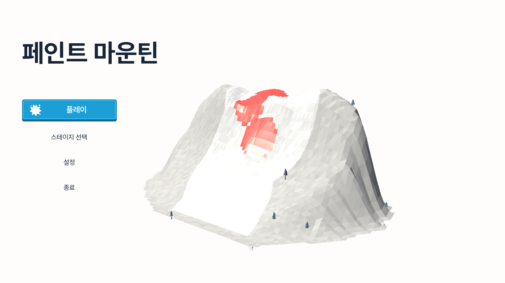

**Player job:** identify the game, start quickly, or choose a secondary route.

**What works**

- The title, primary action, and three secondary actions are easy to locate.
- Only one action is filled blue.
- The menu does not invent unsupported features.

**Problems**

- The mountain is washed out and visually weaker than the empty white field.
- The preview already contains red paint but offers no explanation, so it reads
  as leftover state rather than a promise of play.
- The left menu is a loose vertical text list with little rhythm between title,
  primary action, and secondary actions.
- The paint-splat icon is visually heavy and does not explain why Play differs
  from Stage Select.
- The screen has little identity beyond the title and generic blue button.

**Recommendation**

Make the mountain and its painted route the dominant visual promise. Keep one
primary action, but give the secondary list tighter spacing and a clearer
selected/focus language. Use the same icon and type language as gameplay.

### 2. Stage Select — Critical

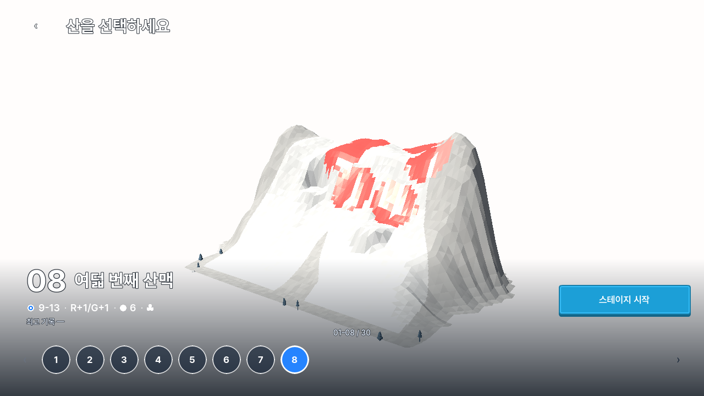

**Player job:** compare stages, understand the selected challenge, and start.

**What works**

- The selected stage uses the real terrain artifact.
- Eight stages are visible per page.
- The selected node and primary Start action are visually distinct.

**Problems**

- The stage rule is compressed into `9-13 · R+1/G+1 · 6 · glyph`, which is too
  cryptic for a core selection decision.
- The stage name and score rule compete at the lower-left while Start floats far
  away on the right.
- Large outlined text has weak consistency and can lose edge clarity over the
  bright terrain.
- The stage rail reads as numbered pagination, not progression. Completion,
  mastery, lock state, difficulty, and chapter change have weak or absent cues.
- The red target preview is very bright, but no legend explains target versus
  existing paint or the role of red/green scoring.
- The large empty upper field creates low information density without creating
  visual drama.

**Recommendation**

Treat this as a challenge-selection screen, not a terrain gallery. Keep the
terrain, but pair the selected stage with one plain-language rule sentence, a
readable target-band label, shot count, and required ball roles. Make the rail
communicate chapter/progress states and move Start into the same decision group.

### 3. Briefing — Critical

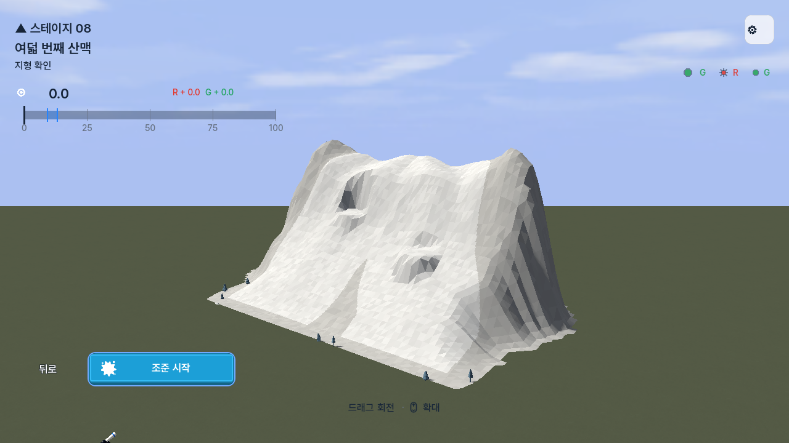

**Player job:** inspect the board, learn the rule, and enter Aim with a plan.

**What works**

- The mountain is large enough to inspect.
- Back and Start are present.
- The complete 0-100 scale and queue are visible.

**Problems**

- The screen says `지형 확인` but does not state the actual success rule in
  plain language.
- The red target surface visible in Stage Select is no longer obvious, so the
  player cannot connect selection, inspection, and scoring.
- The horizontal score scale occupies the upper-left without explaining why a
  zero score matters before a shot.
- Queue glyphs are tiny and detached at the far upper-right.
- Start is a large bevel rectangle while Back is plain text, creating an
  extreme style gap rather than a controlled priority difference.
- Rotation/zoom help is low-contrast and isolated at the bottom.

**Recommendation**

Make Briefing answer three questions: target range, what red and green do, and
which special ball matters. Keep inspection central, but show the target region
and mechanisms with semantic world cues. Group Back and Start at one safe edge.

### 4. Aim — Poor

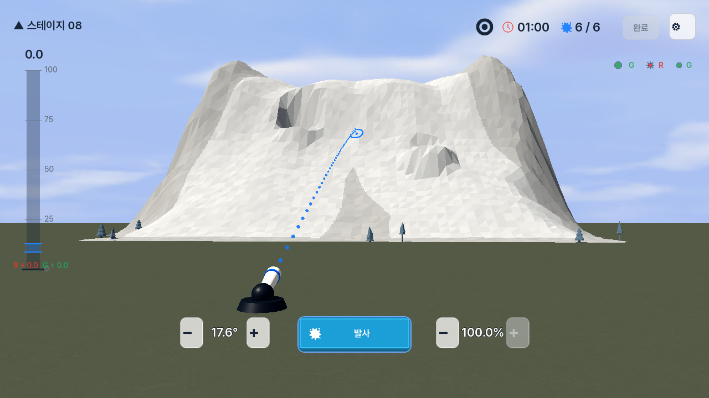

**Player job:** choose a landing point, tune angle/power, and fire.

**What works**

- The cannon, trajectory, landing marker, angle, power, and Fire action are all
  visible in one frame.
- Fire is the only filled gameplay action.
- The 0-100 score domain is complete and signed values remain truthful.

**Problems**

- The mountain is nearly white-on-white, so the trajectory is easier to read
  than the route it is supposed to help plan.
- The score rail dominates the left edge even when the current score is zero,
  but its target band near the bottom is subtle and unexplained.
- Angle and power are split by Fire, yet the cannon sits above-left of that row;
  the interaction does not read as one instrument.
- The top-right queue is too small relative to its importance and provides no
  persistent current-ball name.
- Finish is disabled but gives no visible reason.
- The mode control is an abstract target icon. The player must infer that it
  opens Map Inspection.
- The foreground is visually empty, and the cannon reads as a small black shape
  instead of a tactile launch device.

**Recommendation**

Rebuild the view around one clear loop: target band and current ball, selected
landing point, angle/power instrument, Fire. Strengthen mountain depth and
target/material cues before adding HUD polish. Label the mode and explain
disabled Finish state on focus or hover.

### 5. Ball Queue detail — Critical

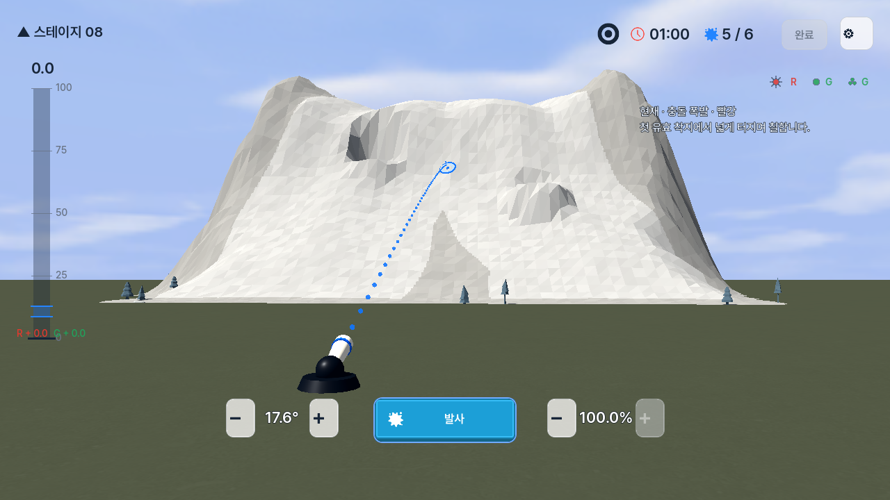

**Player job:** understand what the current and upcoming balls do.

**What works**

- One shared description appears for hover/focus/press.
- The description names the ball kind, paint role, and behavior.
- No duplicate native tooltip appears.

**Problems**

- The detail floats below the queue with weak visual attachment to the selected
  token.
- The token itself is tiny, while the description is long and visually heavier
  than the queue.
- The text uses a hard outline to survive the sky instead of a more controlled
  contrast treatment.
- Essential ball meaning is interaction-gated. A player can reach Fire without
  ever seeing it.
- At compact size, the description overlaps the main mountain/trajectory area.

**Recommendation**

Show a short persistent current-ball label and role. Reserve the expanded
description for focus/hover, anchor it to the selected token, and keep it within
a stable safe area. Use shape plus concise text; do not rely on red/green alone.

### 6. Map Inspection — Poor

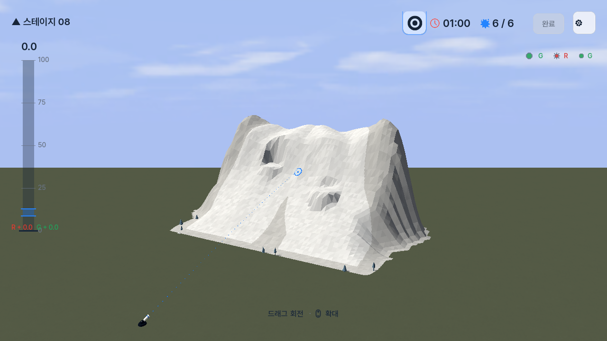

**Player job:** inspect terrain topology without changing the committed aim.

**What works**

- The full terrain mass is visible.
- Aim controls and Fire are removed.
- The selected trajectory remains as spatial context.

**Problems**

- The mode is communicated mainly through a small target-style icon with a blue
  focus outline, not a clear `Map` label.
- The camera is far enough away that the already low-contrast terrain becomes
  even harder to inspect.
- Rotation and zoom instructions are faint and near the bottom edge.
- The left score rail remains prominent even though terrain inspection is the
  task.
- No named landmarks, target boundaries, mechanisms, or route hierarchy help
  the player understand the map.

**Recommendation**

Use a clear mode label and put terrain-reading cues above score telemetry.
Improve lighting/material separation, target boundary, and mechanism
silhouettes so orbiting reveals useful information rather than only a new angle.

### 7. Shot Follow — Critical

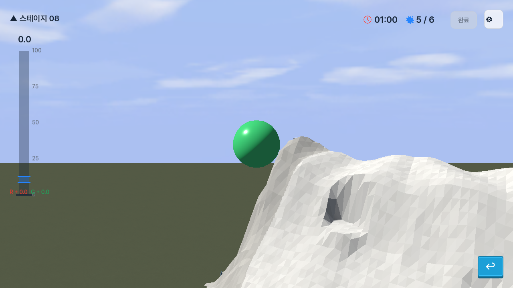

**Player job:** see the ball's path, contact, paint, and consequence.

**What works**

- The active ball is unmistakable.
- Aim controls are absent, so the state does not imply steering.
- Return is placed at a screen edge.

**Problems**

- The ball is oversized relative to the world and can read as a debug-scale
  object instead of a projectile.
- The camera crop hides most of the mountain and gives little spatial context
  for the shot.
- The frame does not show a clear contact/paint/result cause-and-effect chain.
- The persistent score rail competes with the projectile even before a score
  change is visible.
- Return is icon-only, so the action is less discoverable than the spec's named
  `Return to Cannon` behavior.

**Recommendation**

Frame the ball with enough terrain to show where it is going. Prioritize contact
point, paint deposition, target response, and score change as one sequence.
Use a concise visible return label at standard sizes.

### 8. Pause — Mixed

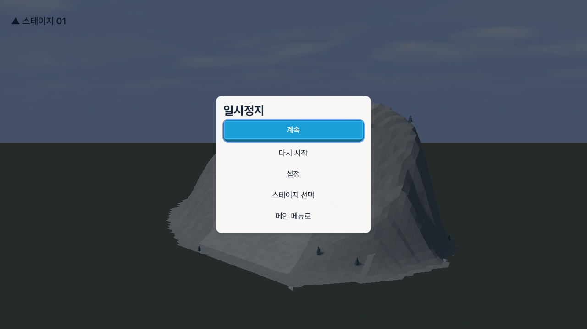

**Player job:** stop safely and choose a navigation action.

**What works**

- One clear interruption surface blocks the game.
- The action order is logical.
- Continue has visible focus and the background is strongly dimmed.

**Problems**

- Continue is a full-width blue slab while all other actions are bare text,
  producing an abrupt visual hierarchy.
- Restart and navigation actions do not disclose confirmation or consequences.
- The surface feels like a generic form rather than part of the game's visual
  identity.
- The menu provides no controller/keyboard hints or visible current focus beyond
  the selected button.

**Recommendation**

Keep the single interruption surface. Refine spacing, icon consistency, and
danger/navigation distinctions. Preserve fast Continue but make secondary
actions feel intentionally interactive rather than plain labels.

### 9. Settings — Mixed

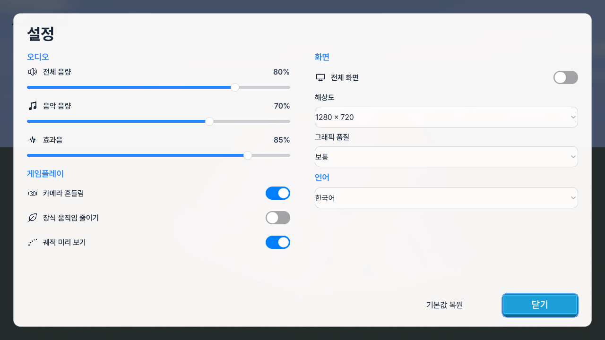

**Player job:** change audio, gameplay, display, and language settings with
confidence.

**What works**

- Categories and labels are clear.
- Values are visible next to sliders and selections.
- The two-column standard layout is easy to scan.
- Reset and Close are separated.

**Problems**

- The panel is much larger than its content and contains a large empty lower
  region.
- Toggle states depend heavily on blue/gray and lack visible `On/Off` text.
- The Fullscreen label and switch are very far apart.
- Slider rails and knobs are visually light, reducing target clarity.
- At 640x360, only the Audio section is initially visible; Gameplay, Display,
  and Language disappear below a subtle scrollbar.
- The large bevel Close button does not match the thin form controls.

**Recommendation**

Use a content-fit desktop sheet and a clearly sectioned compact scroll layout.
Keep labels close to controls, add state text or stronger shape cues to toggles,
and make scroll position and remaining sections obvious.

### 10. Clear Result — Critical

**Player job:** understand why the stage cleared and choose the next action.

**What works**

- Success and the score are prominent.
- The complete score rail and signed contributions are shown.
- Next is the clear primary action.

**Problems**

- The screen shows `11.0` but does not explicitly say that 11 is inside the
  9-13 target band.
- Stars, time, and shot count are compressed into a tiny symbolic line.
- The dark scrim begins with a hard vertical split and feels disconnected from
  the mountain.
- The mountain does not visibly celebrate the painted route or successful
  target outcome.
- `Same deal`, `New deal`, and `Stage` are terse system terms without enough
  context for the decision.
- The primary action is a rectangle while secondary actions are detached text,
  repeating the visual-system inconsistency.

**Recommendation**

State the reason for success in plain language: score inside target, required
colors used, and required special-ball condition met. Make the painted outcome
the hero. Group next/retry/stage actions with clearer labels and one consistent
interaction language.

### 11. Failure Result — Critical

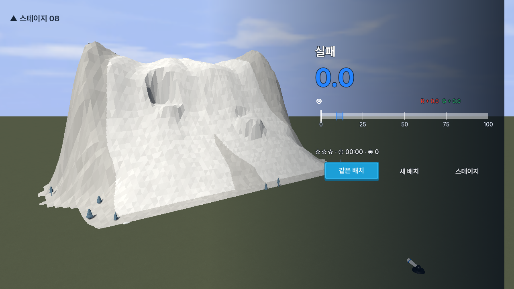

**Player job:** understand the miss and choose a better next attempt.

**What works**

- Failure and score are immediately visible.
- Retry with the same deal is the primary action.
- The rail preserves the target band.

**Problems**

- The screen does not say whether failure came from score, missing color,
  missing special-ball participation, time, or shots.
- A zero score and empty stats look like a synthetic test fixture, reducing
  trust in the result.
- There is no actionable hint based on the player's actual miss.
- The visual treatment is almost identical to success except for one word and
  the number; failure lacks a distinct but restrained emotional response.

**Recommendation**

Explain the failed condition and show the nearest correction. Examples: `3
points below the target band`, `Green paint did not reach the target`, or
`Split ball was not used on the target`. Preserve the same layout as Clear but
change the semantic summary, not only the verdict word.

## Compact journey audit — Critical

The compact set proves that the layouts remain bounded, but not that they remain
usable. These states need dedicated responsive compositions rather than a
smaller rendering of the desktop information model.

### Main Menu and Stage Select

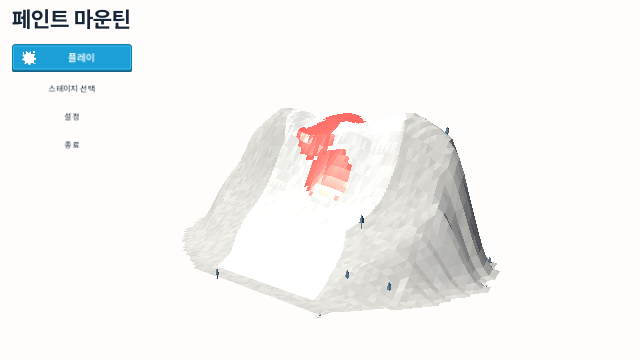

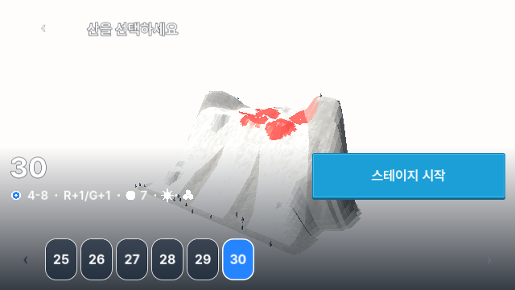

- Main Menu content collapses into the upper-left while most of the viewport is
  unused.
- Secondary actions become very small.
- Stage Select gives the Start button disproportionate space while stage rules
  become a near-symbol-only line.
- The stage name disappears, weakening orientation.

### Briefing, Aim, Queue, and Map

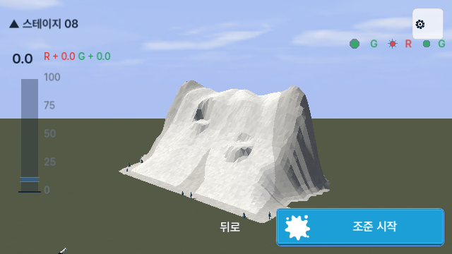

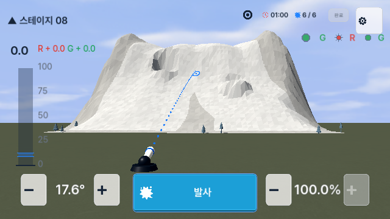

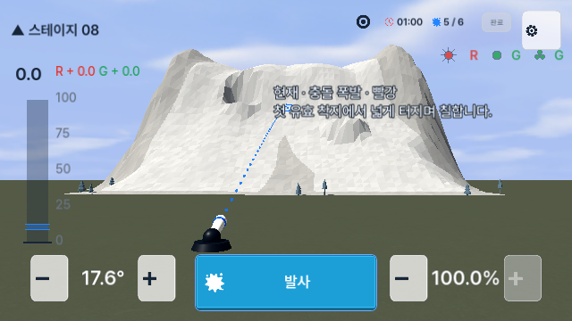

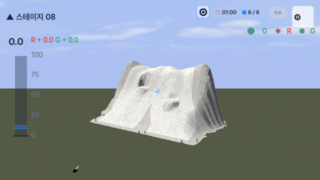

- The large score rail remains while many labels and top-right facts become
  extremely small.
- Aim controls stay operable, but Fire grows into a dominant slab and the world
  is compressed behind it.
- Queue detail occupies the main viewing region.
- Map instructions disappear, leaving an icon-only mode and a tiny world.

### Shot Follow, Pause, Settings, and Results

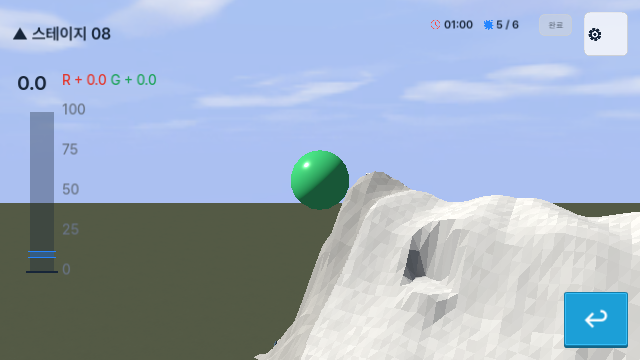

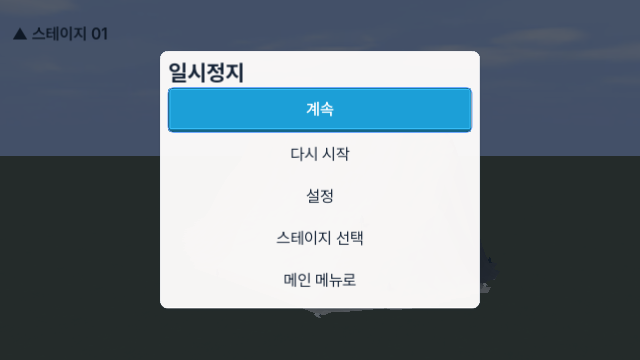

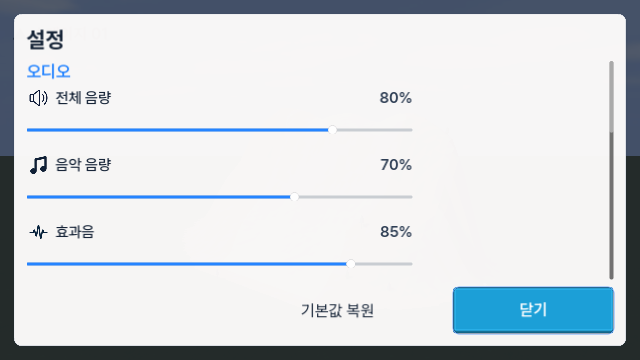

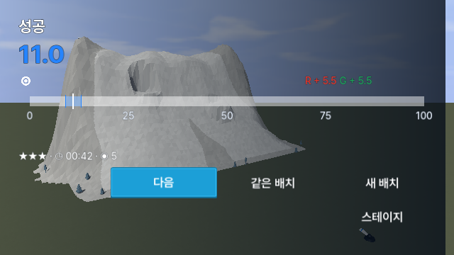

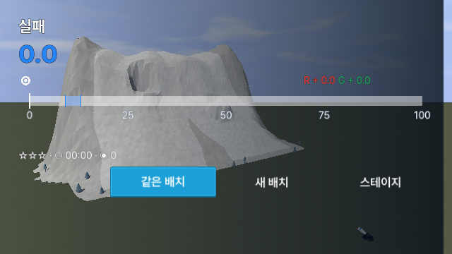

- Shot Follow keeps the ball readable but crops almost all route context.
- Pause is one of the more successful compact states, though its secondary
  actions still look like plain text.
- Settings hides three of four major groups below the fold with only a narrow
  scrollbar as a cue.
- Result actions become widely separated labels; the mountain, verdict, score,
  rail, and actions compete for the same small frame.
- The Result stage identity is removed, which helps fit but harms orientation.

## Late-stage and edge-case representatives

### Stage 07 selection — Poor

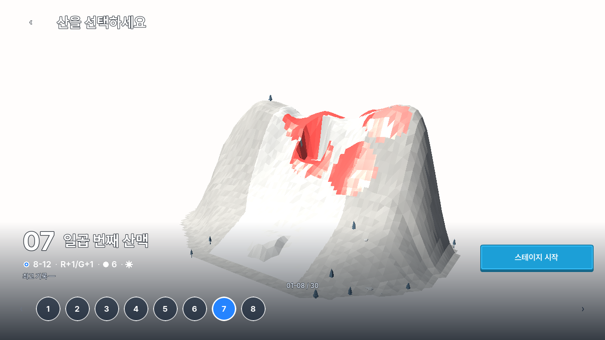

The target preview is visible, but the single required special-ball glyph and
red/green rule remain cryptic. The player cannot tell why Stage 07 starts a new
chapter or what new learning is expected.

### Stage 12 queue detail — Critical

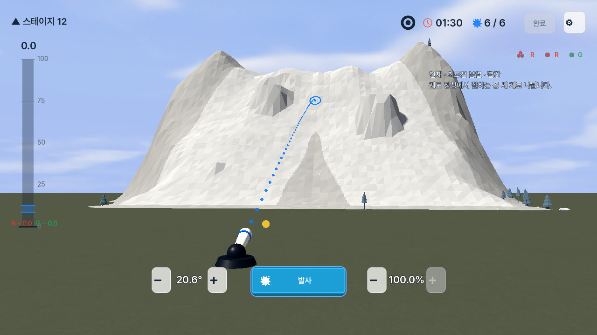

The Apex Split description is informative, but the yellow selected-ball marker
is detached from the top-right red ball glyph. The hierarchy does not clearly
connect physical ball, queue order, paint role, and description.

### Stage 18 selection — Poor

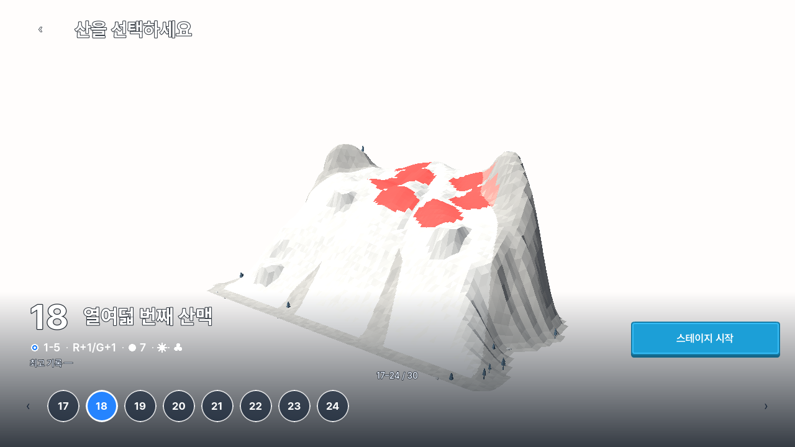

The stage rail pages correctly, but chapter progression is still a set of
numbers. A more complex seven-shot, two-special-ball challenge receives almost
the same explanation as Stage 07.

### Stage 24 queue detail — Critical

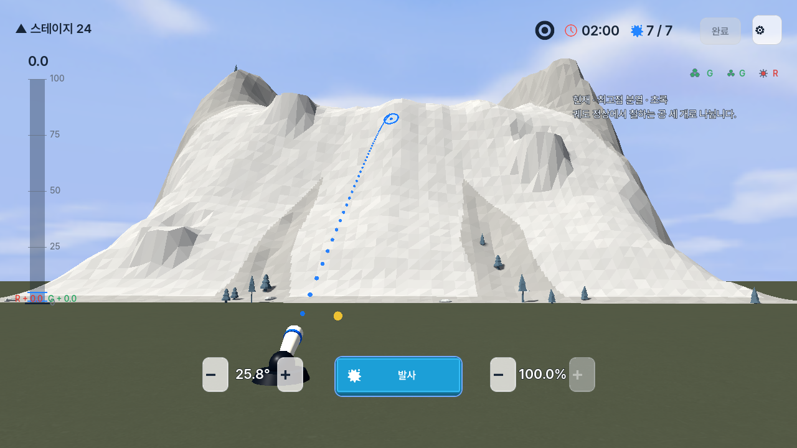

The dense late-stage rule exposes the scalability problem: several small glyphs
and a floating sentence are not enough to support a multi-role plan. The
mountain remains visually dominant in area but not in readable route detail.

### Stage 30 result — Critical

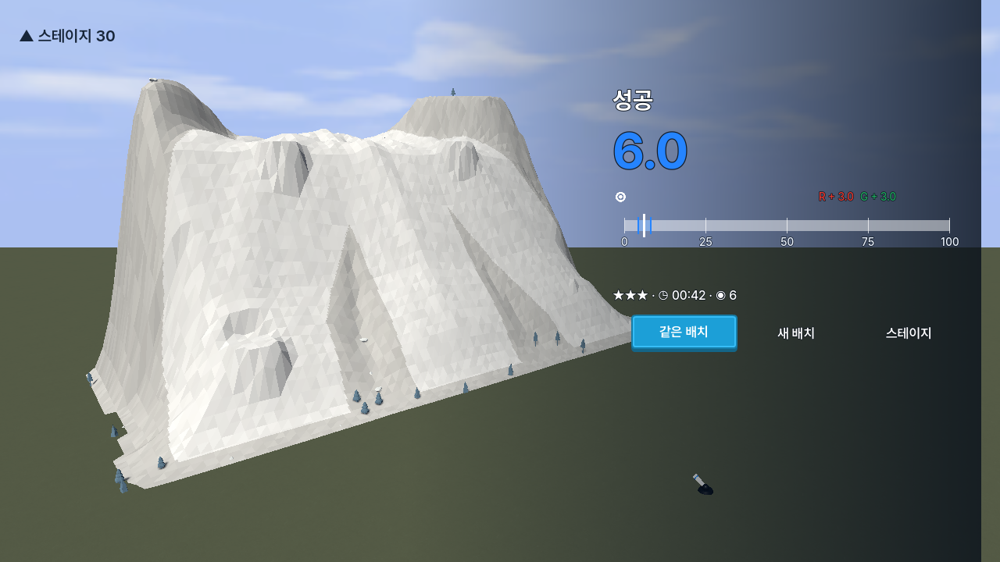

Stage 30 looks almost identical to Stage 08 at Result. The final stage lacks a
meaningful sense of culmination, chapter closure, mastery feedback, or a strong
visual record of the completed paint route.

### Negative score result — Mixed

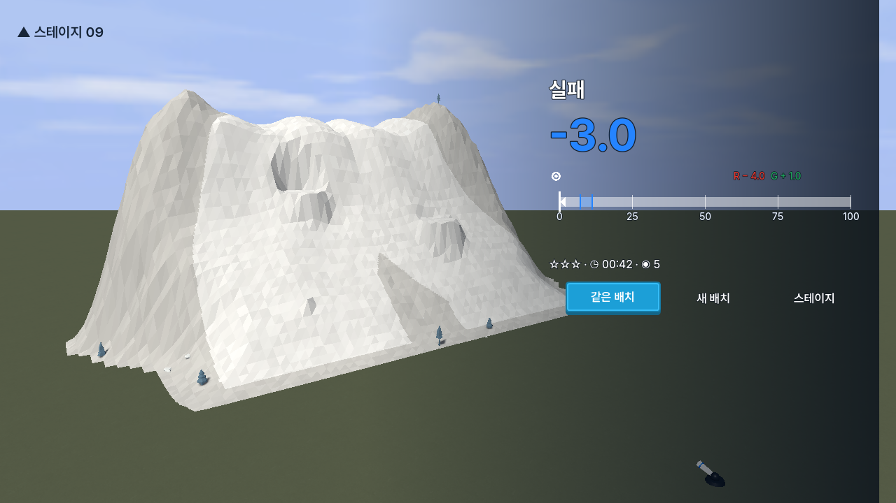

This state correctly preserves `-3.0` and projects only the rail marker. That is
good truthfulness. However, the left overflow marker is subtle, the screen does
not explain that red subtracted four points and green added one in plain
language, and the player receives no correction guidance.

## Accessibility risks

### Visible from screenshots

- Small compact text and glyphs create a high reading-distance risk.
- Thin gray labels over sky, white mountain, or translucent scrims have variable
  contrast and need worst-case measurement.
- Red/green contribution text, toggle state, and some ball roles depend heavily
  on color.
- Several rare actions are icon-only: settings, mode switch, and Shot Follow
  return.
- Compact Settings requires scrolling, but the scroll affordance is subtle and
  the hidden section count is not apparent.
- Focus is visible on captured primary controls, but most other controls were
  not captured in focused states.

### Not verified by screenshots

- complete keyboard path and focus restoration;
- screen-reader names, descriptions, order, and live state announcements;
- controller navigation and focus trapping;
- contrast ratios across every possible world background;
- text scaling to 200 percent;
- reduced-motion behavior in actual animation;
- timing and comprehension of transient shot feedback.

Repository tests and prior evidence cover parts of focus and accessible-name
behavior, but they do not establish the human reading and narration experience.

## Strengths worth preserving

- The running game has a complete captureable flow, not a collection of mockups.
- The authoritative score remains truthful, including negative values.
- The 0-100 scale is complete and consistent across live and result states.
- One primary blue action is usually easy to identify.
- Pause uses a real full-input barrier and one containment surface.
- Settings has sound information architecture at standard size.
- The queue has one behavioral description owner across hover, focus, and
  press.
- The game can render all critical states at standard and compact sizes without
  major clipping.

These are implementation assets for a redesign. They are not reasons to retain
the current composition.

## Prioritized recommendations

### P0 — Re-establish the playable visual foundation

1. **Fix world readability before HUD polish.** Increase value and material
   separation across ridges, terraces, target surface, non-target surface,
   ground, paint, mechanisms, and cannon. Use lighting and camera composition
   to make the mountain read as a puzzle board.
2. **Define one decision hierarchy for Briefing, Aim, and Result.** Target band,
   current ball/role, editable aim, primary action, and outcome reason must have
   a stable reading order.
3. **Replace abbreviations with progressive disclosure.** Show a short
   plain-language rule by default; keep precise R/G and ball details available
   for advanced reading.
4. **Make Result explanatory.** State which success requirements passed or
   which one failed, and connect the feedback to the next attempt.

### P1 — Recompose the full flow

5. **Stage Select:** express chapter, progression, stage rule, and completion;
   keep terrain as evidence, not as the only explanation.
6. **Briefing:** visibly connect target region, mechanisms, ball roles, and the
   stage's success rule.
7. **Aim/Map/Follow:** use named modes, one coherent control instrument, and a
   shot camera that preserves route context.
8. **Responsive layouts:** author separate compact compositions with minimum
   readable text and explicit section navigation. Do not solve compact mode by
   shrinking the desktop canvas.

### P2 — Unify and polish

9. Consolidate icon weight, button depth, outline treatment, typography, and
   semantic color into one visual language.
10. Add measured focus, contrast, text-scaling, narration, and controller tests.
11. Use motion, paint response, sound, and result framing to make Fire feel
    tactile and the final state feel earned.

## Approaches to reject

- Do not fix this by adding more cards, panels, or helper paragraphs.
- Do not treat larger buttons as a substitute for hierarchy.
- Do not preserve the current washed-out mountain while polishing HUD spacing.
- Do not use icon-only controls to reduce clutter before their meaning is clear.
- Do not call a compact state successful only because it does not clip.
- Do not score another audit as `PASS` from automated layout assertions alone.

## Sources

### Local product and implementation evidence

- [Final production capture set](../../../.agents/evidence/2026-08-21-stage-ui-final/README.md)
- [UI/UX guidelines](../../../.agents/design/UIUX_GUIDELINES.md)
- [Art direction](../../../.agents/design/ART_DIRECTION.md)
- [Visual reference register](../../../.agents/design/VISUAL_REFERENCES.md)
- [Previous implementation-focused report](../ui-refinement-2026-08-21/index.html)
- [Approved screen targets](../screen-audit-2026-08-10/index.html)

### Current external guidance

- [Xbox Accessibility Guideline 101: Text display](https://learn.microsoft.com/en-us/xbox/accessibility/xbox-accessibility-guidelines/101)
- [Xbox Accessibility Guideline 102: Contrast](https://learn.microsoft.com/en-us/xbox/accessibility/xbox-accessibility-guidelines/102)
- [Xbox Accessibility Guideline 114: UI context](https://learn.microsoft.com/en-us/xbox/accessibility/xbox-accessibility-guidelines/114)
- [WCAG 2.2](https://www.w3.org/TR/WCAG22/)

The external sources provide accessibility and context principles. They do not
override the Paint Mountain brief or prescribe this game's visual style.

## Limitations

- Screenshots show composition but not input feel, animation timing, audio,
  focus motion, or comprehension over repeated play.
- Result fixtures use the real terminal UI transition with deterministic visible
  score facts; they are layout evidence, not physical clear witnesses.
- No human playtest was run for this audit.
- Exact contrast ratios, text pixel heights, and target sizes were not measured
  in this pass; risks are based on inspected production pixels and should be
  verified instrumentally during redesign QA.
- The report does not authorize or define implementation changes.

## UIUX gate evidence

- Surface: full Paint Mountain player-facing game flow
- Invocation depth: Level 4 redesign/audit
- Files/screens touched: report only; 28 current production screenshots reviewed
- Primary task checked: select, understand, aim, fire, observe, interpret result
- Viewports checked: 1280x720 and 640x360
- States checked: menu, select, briefing, aim, queue detail, map, shot follow,
  pause, settings, clear, failure, late-stage rules, negative score
- Accessibility checks: visible text/contrast/color/focus/scroll/icon risks;
  source evidence for keyboard and accessible-name coverage
- Screenshots: 28 accepted current production viewports
- Exceptions accepted: no new capture because current executable hash exactly
  matches the complete existing batch
- Remaining warnings: interaction, narration, motion, audio, human comprehension,
  and exact measured contrast/text size remain unverified
- Result: **blocked** for UI/UX acceptance; redesign recommended
